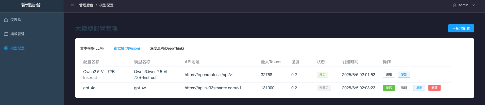
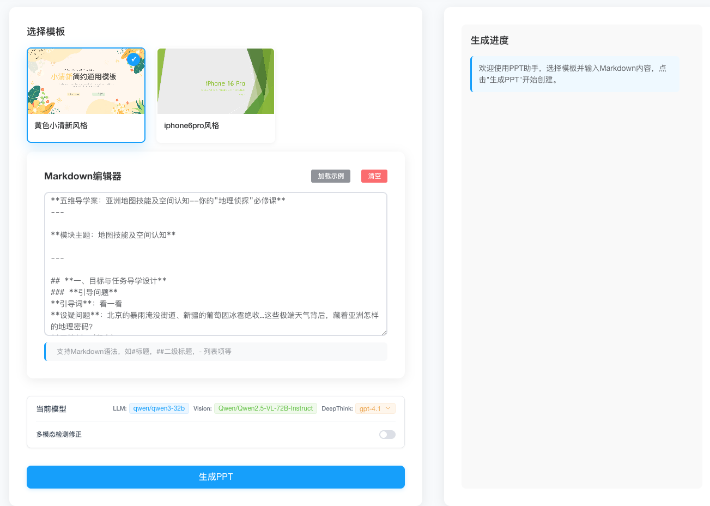

# PPT自动生成系统

基于LangGraph的PPT自动生成系统，可以将Markdown文档自动转换为PPT演示文稿。

## 功能特点

- Markdown解析：自动解析Markdown文档结构
- PPT模板分析：分析PPT模板的布局和风格
- 智能布局决策：匹配内容与合适的PPT布局
- 自动生成PPT：根据解析结果生成最终的PPT文件

## 演示Demo

https://github.com/user-attachments/assets/4292de8d-6f46-43c9-96b3-66e6f5b2add9


## 部署方法

### 方式一：使用Docker部署

```bash
cd docker

# 编辑.env文件
cp .env.example .env

# 执行部署脚本
./deploy.sh build
# 执行启动脚本
./deploy.sh start
```
> 备注：
> - 需要提前安装好docker和docker-compose


### 方式二：使用本地环境部署(适用于开发调试)

#### 1. 安装依赖

```bash
# 创建虚拟环境
conda create -n ppt_gen python=3.12
conda activate ppt_gen

# 安装依赖
pip install -r requirements.txt

# 初始化子模块
git submodule update --init

# 安装ppt_manager
cd libs/ppt_manager
pip install -e .
```

#### 2. 安装LibreOffice

Mac用户可以通过brew安装LibreOffice

```bash
brew install --cask libreoffice
```

安装之后创建soffice的命令脚本
```bash
# 创建软链接
sudo tee /usr/local/bin/soffice <<EOF
#!/bin/bash
/Applications/LibreOffice.app/Contents/MacOS/soffice "\$@"
EOF

# 赋予执行权限
sudo chmod +x /usr/local/bin/soffice

```

验证安装
```bash
soffice --version
```
#### 3. 安装poppler

Mac用户可以通过brew安装poppler
```bash
brew install poppler
```
Linux用户可以通过apt安装poppler
```bash
sudo apt-get install poppler-utils
```

Windows用户需要手动下载安装
下载地址：https://poppler.freedesktop.org/

#### 4. 运行
##### 4.1 复制配置文件
```bash
cp .env.example .env
```

##### 4.2 启动redis服务
```bash
docker-compose -f docker/docker-compose-dev.yml up -d
```

##### 4.3 启动后端FastAPI服务
```bash
uvicorn apps.api.main:app --reload --host 0.0.0.0 --port 8000
```

##### 4.4 启动celery服务
```bash
celery -A apps.api.celery_app worker --loglevel=info --concurrency=2 --pool=solo -Q celery,template_analysis,ppt_generation
```
##### 4.5 启动mlflow服务
```bash
python scripts/start_mlflow_ui.py
```

##### 4.6 启动前端Vue服务
```bash
cd apps/web
npm install --legacy-peer-deps
npm run dev
```

## 使用方法
1. 访问前端页面
> - docker部署：http://localhost  
> - 本地部署：http://localhost:5173

2. 访问管理后台：点击前端页面右上角管理后台按钮，进入管理后台页面(admin/admin123)

3. 配置API_KEY：点击管理后台，分别配置LLM、VLLM、deepthink的API Key


> 备注：
> - 模型配置中的文本模型(LLM)和深度思考(deepthink)，本质都是文本大模型。
> - 前者一般承担比较轻量级的任务，后者一般承担上下文比较长的分析任务，为了节省token消耗，区分使用，但都需要配置。

4. 上传PPT模板：在管理后台，上传PPT模板文件，稍等分析完毕后，即可在管理后台看到分析结果

5. 在前端页面，输入Markdown文档，点击生成PPT按钮


6. 下载PPT：待提示PPT生成完毕后，点击PPT文件，即可下载PPT文件


## 常见问题
- **问题1**： PPT生成过程中，提示"内容规划失败，无法获取内容规划结果".
>问题原因：这种情况是大模型返回的内容存在异常，比如：未按照要求返回。具体可以通过mlflow调试页面查看返回内容。
 
  
- **问题2**： PPT生成过程中，生成的PPT文件内容不全，存在部分内容缺失。
> 问题原因：这种情况是因为大模型在进行内容规划时，对部分内容进行了删减所致。该问题解决方式同问题1。


- **问题3**： 开启多模态能力检测，PPT生成时间变得很长。
> 问题原因：由于目前PPT的视觉检测，主要是依赖于soffice的PPT转图片，这一过程速度慢且无法优化干预，所以暂时没有好的解决方案。

备注：各个模型在不同任务上的表现，可以参考[模型对比](./docs/report/PPT生成各模型实验结果.md)


## 项目结构

```bash
ppt-assisstant/
├── apps/                  # 应用层
│   ├── api/               # FastAPI接口服务
│   │   ├── routers/       # 接口路由
│   │   │   ├── agent.py   # Agent能力接口
│   │   │   └── file.py    # 文件处理接口
│   │   ├── models/        # 接口数据模型
│   │   ├── dependencies/  # 接口依赖项
│   │   └── main.py        # FastAPI入口
│   │
│   └── web/               # 前端工程
│       ├── public/        # 静态资源
│       ├── src/           # 前端源码
│       └── package.json   # 前端依赖
│
├── core/                  # 核心业务
│   ├── agents/            # LangGraph Agent实现
│   │   ├── markdown_agent.py           # Markdown解析
│   │   ├── ppt_analysis_agent.py       # PPT分析
│   │   ├── content_planning_agent.py   # 内容规划
│   │   ├── slide_generator_agent.py    # 幻灯片生成
│   │   ├── ppt_finalizer_agent.py      # PPT清理与保存
│   │   └── base_agent.py               # 基础Agent
│   │
│   ├── workflows/         # 工作流配置
│   │   ├── ppt_gen.yaml   # 主工作流配置
│   │   └── utils.py       # 工作流工具
│   │
│   └── engine/            # 执行引擎
│       ├── state.py       # 状态管理
│       └── workflow.py    # 工作流引擎
│
├── libs/                  # 第三方库
│   ├── ppt_manager/       # PPT操作库（git子模块）
│   └── ...                # 其他子模块
│
├── workspace/             # 运行时文件
│   ├── sessions/          # 会话数据
│   │   └── {session_id}/  # 按会话隔离
│   ├── cache/             # 缓存文件
│   ├── logs/              # 系统日志
│   ├── mlflow/            # mlflow调试日志
│   ├── outputs/           # 输出文件
│   ├── data/              # 数据文件
│   └── temp/              # 临时文件
│
├── config/                # 配置中心
│   ├── prompts/           # 提示词
│   ├── settings.py        # 应用配置
│   └── model_config.yaml  # 模型配置
│
├── docs/                  # 文档中心
│   ├── arch/              # 架构设计
│   ├── report/            # 报告
│   ├── prd/               # 需求文档
│   └── api/               # API文档
│
├── tests/                 # 测试体系
│   ├── test_files/        # 测试文件
│   └── test_utils.py      # 测试工具
│
├── Dockerfile             # 容器化构建
├── docker-compose.yml     # 服务编排
└── requirements.txt       # Python依赖
```


## 📄 许可证

本项目采用 **Apache License 2.0** 开源许可证。

### 商业使用说明

- ✅ **开源免费使用**：您可以自由使用、修改和分发本软件
- ✅ **商业用途友好**：允许在商业项目中使用，无需支付许可费
- ✅ **专利保护**：提供明确的专利许可条款
- ⚠️ **版权声明要求**：使用时必须保留原始版权声明


## 🙏 致谢
本项目核心思想来源于[PPTAgent](https://github.com/icip-cas/PPTAgent)提出的**多模态大语言模型+Agent框架**。我们诚挚感谢该项目提供的创新思路，这为本工程的设计和实现奠定了关键基础。
