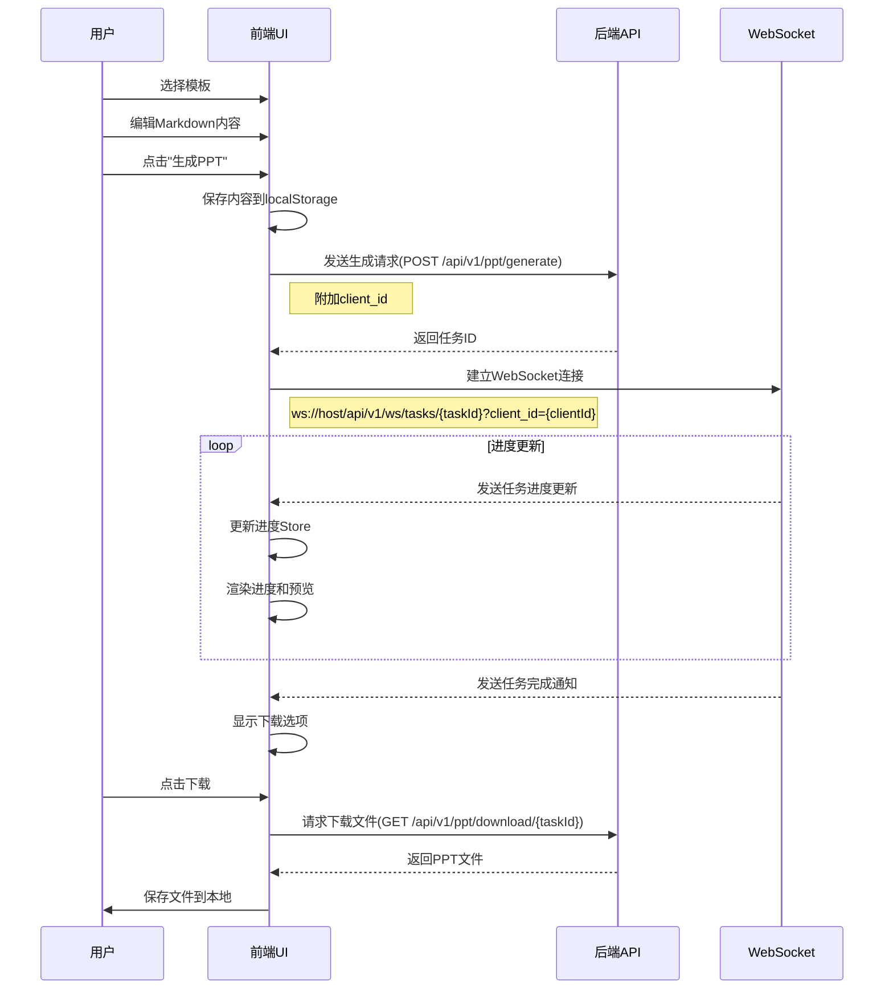
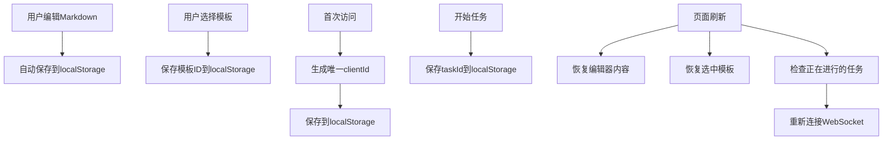

# PPT助手系统前端架构设计

## 1. 技术栈选择

### 1.1 核心框架
- **Vue 3**: 采用组合式API(Composition API)，更好的类型推导和性能
- **Typescript**: 提供类型安全和更好的开发体验
- **Vite**: 作为构建工具，提供快速的开发环境和高效的构建过程

### 1.2 UI组件库
- **Element Plus**: 基于Vue 3的企业级UI组件库，提供丰富的组件和主题定制能力
- **TailwindCSS**: 提供原子化CSS工具，灵活定制UI样式

### 1.3 状态管理
- **Pinia**: Vue 3官方推荐的状态管理库，替代Vuex，提供更简洁的API和更好的TypeScript支持

### 1.4 路由
- **Vue Router**: Vue官方路由管理器，处理前端路由

### 1.5 HTTP请求
- **Axios**: 基于Promise的HTTP客户端，用于与后端API交互

### 1.6 Markdown编辑器
- **Markdown-it**: 用于Markdown渲染
- **CodeMirror**: 实现代码编辑器功能，支持Markdown语法高亮

### 1.7 WebSocket
- **Socket.io-client**: 用于实时任务进度更新

### 1.8 其他工具库
- **dayjs**: 轻量级日期处理库
- **lodash-es**: 实用工具函数库(ES模块版本)
- **uuid**: 生成唯一标识符
- **nanoid**: 生成唯一客户端ID，用于用户会话隔离

## 2. 项目结构

```
apps/
└── web/                           # 前端工程目录
    ├── public/                    # 静态资源
    │   ├── favicon.ico            # 网站图标
    │   └── images/                # 静态图片资源
    │       └── placeholders/      # 占位图片
    ├── index.html                 # HTML模板
    ├── src/                       # 源代码
    │   ├── assets/                # 静态资源(图片、字体等)
    │   │   ├── fonts/             # 字体文件
    │   │   ├── images/            # 图片资源
    │   │   └── styles/            # 样式文件
    │   ├── components/            # 全局公共组件
    │   │   ├── common/            # 通用基础组件
    │   │   │   ├── BaseButton.vue     # 基础按钮
    │   │   │   ├── BaseInput.vue      # 基础输入框
    │   │   │   ├── BaseAlert.vue      # 基础提示框
    │   │   │   └── BaseLoading.vue    # 加载指示器
    │   │   ├── layout/            # 布局相关组件
    │   │   │   ├── AppHeader.vue      # 应用头部
    │   │   │   ├── AppFooter.vue      # 应用底部
    │   │   │   └── MainLayout.vue     # 主布局容器
    │   │   ├── business/          # 业务相关组件
    │   │   │   ├── TemplateCard.vue   # 模板卡片
    │   │   │   └── ProgressBar.vue    # 进度条
    │   │   ├── editor/            # Markdown编辑器相关组件
    │   │   │   ├── MarkdownEditor.vue # Markdown编辑器
    │   │   │   └── EditorToolbar.vue  # 编辑器工具栏
    │   │   ├── preview/           # PPT预览相关组件
    │   │   │   ├── SlidePreview.vue   # 幻灯片预览
    │   │   │   └── PreviewGallery.vue # 预览图库
    │   │   └── task/              # 任务状态和进度相关组件
    │   │       ├── TaskProgress.vue   # 任务进度
    │   │       ├── ChatStyleMessage.vue # 对话式消息
    │   │       └── ChatThread.vue     # 对话消息列表
    │   ├── composables/           # 组合式函数(hooks)
    │   │   ├── useMarkdown.ts     # Markdown相关逻辑
    │   │   ├── useTemplates.ts    # 模板相关逻辑
    │   │   ├── useTaskProgress.ts # 任务进度相关逻辑
    │   │   ├── useClientId.ts     # 客户端ID管理
    │   │   ├── useFileUpload.ts   # 文件上传相关逻辑
    │   │   ├── useWebSocket.ts    # WebSocket相关逻辑
    │   │   └── useLocalStorage.ts # 本地存储相关逻辑
    │   ├── config/                # 全局配置
    │   │   ├── api.config.ts      # API地址配置
    │   │   ├── websocket.config.ts # WebSocket配置
    │   │   └── app.config.ts      # 应用全局配置
    │   ├── constants/             # 常量定义
    │   │   ├── api.constants.ts   # API相关常量
    │   │   ├── storage.constants.ts # 存储键名常量
    │   │   └── task.constants.ts  # 任务状态常量
    │   ├── directives/            # 自定义指令
    │   │   ├── click-outside.ts   # 点击外部指令
    │   │   └── lazy-load.ts       # 图片懒加载指令
    │   ├── models/                # 数据模型接口定义
    │   │   ├── template.ts        # 模板相关数据模型
    │   │   ├── task.ts            # 任务相关数据模型
    │   │   ├── progress.ts        # 进度相关数据模型
    │   │   └── user.ts            # 用户相关数据模型
    │   ├── pages/                 # 页面组件
    │   │   ├── home/              # 首页(PPT生成页面)
    │   │   │   ├── HomePage.vue       # 首页主组件
    │   │   │   ├── EditorPanel.vue    # 编辑器面板
    │   │   │   ├── TemplateSelector.vue # 模板选择器
    │   │   │   ├── TaskProgressPanel.vue # 任务进度面板
    │   │   │   └── DownloadPanel.vue  # 下载面板
    │   │   ├── admin/             # 管理后台页面
    │   │   │   ├── AdminLayout.vue    # 管理后台布局
    │   │   │   ├── AdminLogin.vue     # 管理员登录
    │   │   │   ├── AdminDashboard.vue # 管理员仪表盘
    │   │   │   └── template/          # 模板管理页面
    │   │   │       ├── TemplateList.vue  # 模板列表
    │   │   │       ├── TemplateForm.vue  # 模板表单
    │   │   │       └── TemplateDetail.vue # 模板详情
    │   │   └── error/             # 错误页面
    │   │       ├── NotFound.vue       # 404页面
    │   │       └── Unauthorized.vue   # 未授权页面
    │   ├── router/                # 路由配置
    │   │   ├── index.ts           # 路由主文件
    │   │   ├── home.routes.ts     # 首页路由
    │   │   ├── admin.routes.ts    # 管理后台路由
    │   │   └── guards.ts          # 路由守卫
    │   ├── services/              # API服务封装
    │   │   ├── api/               # 具体API调用方法
    │   │   │   ├── template.api.ts    # 模板相关API
    │   │   │   ├── ppt.api.ts         # PPT生成相关API
    │   │   │   ├── admin.api.ts       # 管理后台相关API
    │   │   │   └── auth.api.ts        # 认证相关API
    │   │   ├── http.ts            # Axios实例和拦截器配置
    │   │   └── websocket.ts       # WebSocket客户端
    │   ├── stores/                # Pinia状态存储
    │   │   ├── editor.ts          # 编辑器状态
    │   │   ├── template.ts        # 模板状态
    │   │   ├── task.ts            # 任务状态
    │   │   ├── auth.ts            # 认证状态
    │   │   ├── progress.ts        # 进度状态
    │   │   └── client.ts          # 客户端状态
    │   ├── styles/                # 全局样式
    │   │   ├── main.scss          # 主样式文件
    │   │   ├── variables.scss     # 样式变量
    │   │   ├── tailwind.scss      # TailwindCSS配置
    │   │   └── transitions.scss   # 过渡动画
    │   ├── types/                 # 类型定义
    │   │   ├── api.d.ts           # API响应类型
    │   │   ├── components.d.ts    # 组件属性类型
    │   │   └── global.d.ts        # 全局类型声明
    │   ├── utils/                 # 工具函数
    │   │   ├── storage.ts         # 本地存储工具
    │   │   ├── clientId.ts        # 客户端ID生成工具
    │   │   ├── formatters.ts      # 格式化工具
    │   │   ├── validators.ts      # 验证工具
    │   │   ├── errorHandlers.ts   # 错误处理工具
    │   │   └── download.ts        # 文件下载工具
    │   ├── App.vue                # 根组件
    │   ├── main.ts                # 应用入口
    │   └── env.d.ts               # 环境变量类型声明
    ├── tests/                     # 测试目录
    │   ├── unit/                  # 单元测试
    │   │   └── components/        # 组件测试
    │   └── e2e/                   # 端到端测试
    ├── .env                       # 基本环境变量
    ├── .env.development           # 开发环境变量
    ├── .env.production            # 生产环境变量
    ├── tsconfig.json              # TypeScript配置
    ├── vite.config.ts             # Vite配置
    ├── tailwind.config.js         # TailwindCSS配置
    ├── postcss.config.js          # PostCSS配置
    ├── jest.config.js             # Jest测试配置
    ├── .eslintrc.js               # ESLint配置
    ├── .prettierrc                # Prettier配置
    └── package.json               # 依赖配置
```

## 3. 架构设计

### 3.1 总体架构

采用前后端分离架构，前端负责UI渲染和用户交互，通过HTTP API和WebSocket与后端通信。

#### 架构图
```
+------------------+    HTTP/WS    +------------------+
|                  |<------------->|                  |
|   Vue前端应用     |               |   后端服务        |
|                  |               |                  |
+------------------+               +------------------+
         |
         | 组成
         v
+------------------+    +------------------+    +------------------+
|                  |    |                  |    |                  |
|  用户界面组件     |<-->|   业务逻辑层      |<-->|   数据访问层      |
|  (Vue组件)       |    | (Composables)    |    | (API Services)   |
|                  |    |                  |    |                  |
+------------------+    +------------------+    +------------------+
                               |
                               v
                        +------------------+
                        |                  |
                        |   状态管理        |
                        |   (Pinia)        |
                        |                  |
                        +------------------+
```

### 3.2 模块设计

#### 3.2.1 用户会话模块
- 客户端ID生成与管理
- 用户会话隔离
- 本地数据持久化

#### 3.2.2 模板管理模块
- 模板列表展示
- 模板详情查看
- 模板上传(管理员功能)
- 模板编辑和删除(管理员功能)

#### 3.2.3 PPT生成模块
- Markdown编辑器
- 模板选择
- 生成进度展示
- 实时预览
- 任务管理(重试、取消等)
- 结果下载

#### 3.2.4 对话式进度展示模块
- 类似大模型对话的交互界面
- 任务状态实时更新
- 预览图片实时展示
- 错误信息提示

#### 3.2.5 管理后台模块
- 登录/登出功能
- 权限控制
- 模板管理
- 系统配置

### 3.3 状态管理设计

使用Pinia进行状态管理，主要分为以下几个Store：

#### 3.3.1 用户Store (authStore)
```typescript
export const useAuthStore = defineStore('auth', () => {
  const token = ref('');
  const userInfo = ref<UserInfo | null>(null);
  const isLoggedIn = computed(() => !!token.value);
  
  async function login(username: string, password: string) {
    // 实现登录逻辑
  }
  
  function logout() {
    // 实现登出逻辑
  }
  
  return { token, userInfo, isLoggedIn, login, logout };
});
```

#### 3.3.2 客户端会话Store (clientStore)
```typescript
export const useClientStore = defineStore('client', () => {
  // 从localStorage获取或生成新的客户端ID
  const clientId = ref(getClientId());
  
  // 当前会话关联的任务ID
  const currentTaskId = ref<string | null>(null);
  
  function setCurrentTask(taskId: string) {
    currentTaskId.value = taskId;
    // 保存到localStorage
    localStorage.setItem('current_task_id', taskId);
  }
  
  function clearCurrentTask() {
    currentTaskId.value = null;
    localStorage.removeItem('current_task_id');
  }
  
  return { 
    clientId, 
    currentTaskId, 
    setCurrentTask, 
    clearCurrentTask 
  };
});
```

#### 3.3.3 编辑器Store (editorStore)
```typescript
export const useEditorStore = defineStore('editor', () => {
  // Markdown内容
  const markdownContent = ref(localStorage.getItem('markdown_content') || '');
  
  // 监听内容变化，自动保存到localStorage
  watch(markdownContent, (newContent) => {
    localStorage.setItem('markdown_content', newContent);
  });
  
  function setMarkdownContent(content: string) {
    markdownContent.value = content;
  }
  
  function clearMarkdownContent() {
    markdownContent.value = '';
    localStorage.removeItem('markdown_content');
  }
  
  return { 
    markdownContent,
    setMarkdownContent,
    clearMarkdownContent
  };
});
```

#### 3.3.4 模板Store (templateStore)
```typescript
export const useTemplateStore = defineStore('template', () => {
  const templates = ref<Template[]>([]);
  const currentTemplate = ref<Template | null>(null);
  
  async function fetchTemplates(page = 1, limit = 10) {
    // 获取模板列表
  }
  
  async function fetchTemplateById(id: number) {
    // 获取模板详情
  }
  
  function setCurrentTemplate(template: Template) {
    currentTemplate.value = template;
    // 可选：保存选择到localStorage
    localStorage.setItem('selected_template_id', template.id.toString());
  }
  
  return { 
    templates, 
    currentTemplate, 
    fetchTemplates, 
    fetchTemplateById,
    setCurrentTemplate
  };
});
```

#### 3.3.5 任务进度Store (progressStore)
```typescript
export const useProgressStore = defineStore('progress', () => {
  const taskStatus = ref<TaskStatus | null>(null);
  const progressMessages = ref<ProgressMessage[]>([]);
  const previewImages = ref<PreviewImage[]>([]);
  const isGenerating = ref(false);
  
  function updateTaskProgress(progressData: any) {
    // 更新任务进度(由WebSocket触发)
    if (progressData.status) {
      taskStatus.value = progressData.status;
    }
    
    // 添加新的进度消息
    if (progressData.step_description) {
      progressMessages.value.push({
        id: nanoid(),
        time: new Date(),
        step: progressData.current_step,
        message: progressData.step_description,
        progress: progressData.progress
      });
    }
    
    // 更新预览图
    if (progressData.preview_data && progressData.preview_data.images) {
      previewImages.value = [
        ...previewImages.value,
        ...progressData.preview_data.images.map((img: string) => ({
          id: nanoid(),
          url: img,
          time: new Date()
        }))
      ];
    }
    
    // 更新生成状态
    isGenerating.value = progressData.status === 'processing';
  }
  
  function resetProgress() {
    taskStatus.value = null;
    progressMessages.value = [];
    previewImages.value = [];
    isGenerating.value = false;
  }
  
  return { 
    taskStatus, 
    progressMessages, 
    previewImages,
    isGenerating,
    updateTaskProgress,
    resetProgress
  };
});
```

### 3.4 API服务设计

使用统一的API服务层封装所有后端接口调用：

```typescript
// 基础API服务
class ApiService {
  protected axios: AxiosInstance;
  
  constructor() {
    this.axios = axios.create({
      baseURL: '/api/v1',
      timeout: 30000
    });
    
    this.setupInterceptors();
  }
  
  private setupInterceptors() {
    // 添加请求和响应拦截器
  }
}

// 模板API服务
class TemplateApiService extends ApiService {
  async getTemplates(page = 1, limit = 10) {
    return this.axios.get('/templates', { params: { page, limit } });
  }
  
  async getTemplateById(id: number) {
    return this.axios.get(`/templates/${id}`);
  }
  
  // 其他模板相关API...
}

// PPT生成API服务
class PptApiService extends ApiService {
  async createPptTask(templateId: number, markdownContent: string) {
    return this.axios.post('/ppt/generate', {
      template_id: templateId,
      markdown_content: markdownContent
    });
  }
  
  async getTaskStatus(taskId: string) {
    return this.axios.get(`/ppt/tasks/${taskId}`);
  }
  
  // 其他PPT相关API...
}
```

### 3.5 WebSocket服务设计

为实时获取任务进度，实现WebSocket客户端服务：

```typescript
class WebSocketService {
  private socket: any = null;
  private taskId: string | null = null;
  
  connect(taskId: string, onProgressUpdate: (data: any) => void) {
    this.taskId = taskId;
    this.socket = io(`${WS_BASE_URL}/tasks/${taskId}`);
    
    this.socket.on('connect', () => {
      console.log('WebSocket connected');
    });
    
    this.socket.on('task_update', (data: any) => {
      onProgressUpdate(data);
    });
    
    this.socket.on('disconnect', () => {
      console.log('WebSocket disconnected');
    });
  }
  
  disconnect() {
    if (this.socket) {
      this.socket.disconnect();
      this.socket = null;
      this.taskId = null;
    }
  }
}
```

### 3.6 页面组件设计

#### 3.6.1 首页(PPT生成页面)
```vue
<!-- HomePage.vue -->
<template>
  <div class="home-page">
    <div class="flex flex-row h-screen">
      <!-- 左侧编辑区域 -->
      <div class="w-1/2 p-4 flex flex-col">
        <TemplateSelector />
        <EditorPanel />
        <GenerationControls @generate="startGeneration" />
      </div>
      
      <!-- 右侧预览和任务进度区域 -->
      <div class="w-1/2 p-4 flex flex-col">
        <!-- 类似大模型对话的进度和预览展示 -->
        <div class="flex-grow overflow-auto bg-gray-50 rounded-lg p-4">
          <ChatStyleProgress />
        </div>
        
        <!-- 下载选项 -->
        <DownloadOptions v-if="taskCompleted" />
      </div>
    </div>
  </div>
</template>
```


ChatStyleProgress组件
```vue
<!-- ChatStyleProgress.vue -->
<template>
  <div class="chat-progress">
    <!-- 欢迎消息 -->
    <div class="message system-message">
      <div class="message-content">
        欢迎使用PPT助手，选择模板并输入Markdown内容，点击"生成PPT"开始创建。
      </div>
    </div>
    
    <!-- 进度消息列表 -->
    <div 
      v-for="message in progressMessages" 
      :key="message.id"
      class="message progress-message"
    >
      <div class="message-header">
        <span class="step-name">{{ message.step }}</span>
        <span class="progress-percent">{{ message.progress }}%</span>
        <span class="message-time">{{ formatTime(message.time) }}</span>
      </div>
      <div class="message-content">
        {{ message.message }}
      </div>
      
      <!-- 预览图片 -->
      <div v-if="getPreviewForMessage(message.id)" class="preview-container">
        
      </div>
    </div>
    
    <!-- 加载中动画 -->
    <div v-if="isGenerating" class="loading-indicator">
      <div class="loading-dots">
        <span></span>
        <span></span>
        <span></span>
      </div>
    </div>
  </div>
</template>
```

#### 3.6.2 管理后台页面

```vue
<!-- AdminLogin.vue -->
<template>
  <div class="admin-login">
    <div class="login-container">
      <h1>PPT助手管理后台</h1>
      <el-form :model="loginForm" :rules="rules" ref="loginFormRef">
        <el-form-item prop="username">
          <el-input v-model="loginForm.username" placeholder="用户名" />
        </el-form-item>
        <el-form-item prop="password">
          <el-input 
            v-model="loginForm.password" 
            type="password" 
            placeholder="密码" 
            @keyup.enter="handleLogin"
          />
        </el-form-item>
        <el-form-item>
          <el-button type="primary" @click="handleLogin" :loading="loading">
            登录
          </el-button>
        </el-form-item>
      </el-form>
    </div>
  </div>
</template>
```

### 3.7 路由设计

```typescript
import { createRouter, createWebHistory } from 'vue-router';
import { useAuthStore } from '@/stores/auth';
import homeRoutes from './home.routes';
import adminRoutes from './admin.routes';

const router = createRouter({
  history: createWebHistory(),
  routes: [
    ...homeRoutes,
    ...adminRoutes,
    {
      path: '/:pathMatch(.*)*',
      name: 'not-found',
      component: () => import('@/pages/error/NotFound.vue'),
      meta: { title: '页面未找到' }
    }
  ]
});

// 路由守卫 - 管理后台需要登录
router.beforeEach((to, from, next) => {
  // 设置页面标题
  document.title = to.meta.title ? `${to.meta.title} - PPT助手` : 'PPT助手';
  
  // 检查是否需要登录
  if (to.meta.requiresAuth) {
    const authStore = useAuthStore();
    
    if (!authStore.isLoggedIn) {
      // 保存原始跳转URL
      next({
        name: 'admin-login',
        query: { redirect: to.fullPath }
      });
      return;
    }
  }
  
  next();
});

export default router;
```

## 4. 数据流设计
```javascript
// router/admin.routes.ts
export default [
  {
    path: '/admin',
    component: () => import('@/pages/admin/AdminLayout.vue'),
    children: [
      {
        path: '',
        name: 'admin-dashboard',
        component: () => import('@/pages/admin/AdminDashboard.vue'),
        meta: { 
          title: '管理后台',
          requiresAuth: true
        }
      },
      {
        path: 'templates',
        name: 'template-management',
        component: () => import('@/pages/admin/TemplateManagement.vue'),
        meta: { 
          title: '模板管理',
          requiresAuth: true
        }
      },
      // 其他管理页面...
    ]
  },
  {
    path: '/admin/login',
    name: 'admin-login',
    component: () => import('@/pages/admin/AdminLogin.vue'),
    meta: { title: '管理员登录' }
  }
];
```


### 4.1 单向数据流



### 4.2 WebSocket数据流


## 5. 安全设计

### 5.1 认证与授权
- 基于JWT的认证机制
- 请求拦截器自动添加Authorization头
- 响应拦截器处理401/403错误，重定向到登录页面
- 路由守卫验证用户访问权限

### 5.2 数据安全
- 敏感数据不保存到localStorage，优先使用内存状态
- 登出时清除所有敏感信息
- API传输数据进行必要的加密或混淆

## 6. 性能优化策略

### 6.1 加载性能
- 路由懒加载
- 组件异步加载
- 图片懒加载和优化
- 代码分割(Code Splitting)

### 6.2 运行时性能
- Vue 3的响应式系统优化
- 合理使用`v-memo`和`v-once`
- 大列表使用虚拟滚动
- 防抖和节流处理频繁事件

### 6.3 缓存策略
- API响应缓存
- 模板数据本地缓存
- 合理设置HTTP缓存头

## 7. 错误处理机制

### 7.1 全局错误处理
- Vue全局错误处理器
- Axios响应拦截器统一处理HTTP错误
- 友好的错误提示UI

### 7.2 业务错误处理
- API返回的业务错误码映射
- 表单验证错误处理
- 任务执行错误处理与重试机制

## 8. 国际化支持

基于i18n实现多语言支持：
- 中文(默认)
- 英文(可扩展)
- 其他语言(可扩展)

## 9. 可访问性(A11Y)设计

- 语义化HTML结构
- ARIA属性支持
- 键盘导航支持
- 对比度和字体大小考虑

## 10. 测试策略

### 10.1 单元测试
- Vue Test Utils + Vitest
- 测试关键组件和业务逻辑

### 10.2 集成测试
- 页面交互流程测试
- API调用测试

### 10.3 端到端测试
- Cypress进行关键用户流程测试

## 11. 构建与部署

### 11.1 构建配置
- 开发环境配置
- 测试环境配置
- 生产环境配置

### 11.2 部署策略
- 静态文件部署
- 环境变量管理
- CI/CD集成
