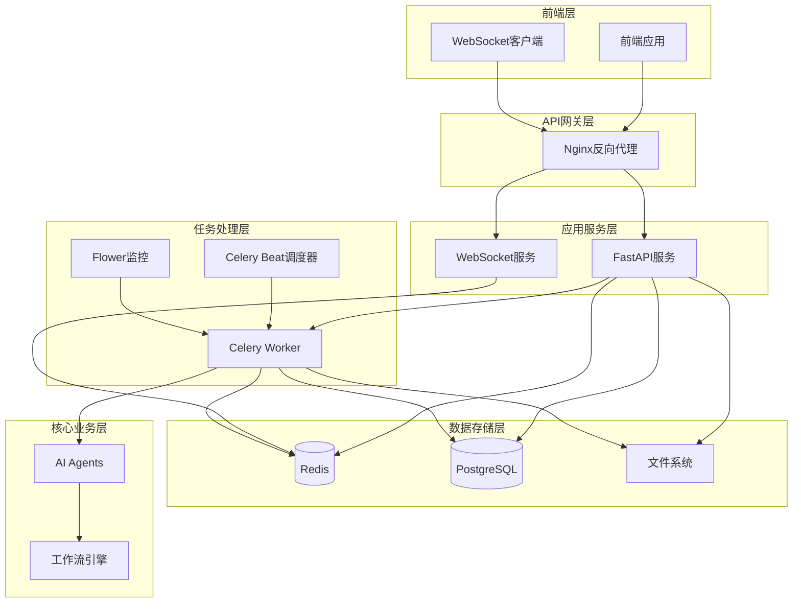

# PPT助手系统后端架构设计

## 1. 架构概述

PPT助手系统后端采用微服务架构，基于FastAPI构建RESTful API服务，使用Celery进行异步任务管理，Redis作为消息队列和缓存存储，WebSocket提供实时通信能力。系统支持高并发PPT生成请求，提供完整的模板管理功能。

### 1.1 技术栈选型

- **Web框架**: FastAPI - 高性能异步Web框架，支持自动API文档生成
- **异步任务队列**: Celery - 分布式任务队列，支持任务调度和监控
- **消息代理**: Redis - 高性能内存数据库，作为Celery broker和结果存储
- **数据库**: PostgreSQL - 关系型数据库，存储用户、模板、任务等数据
- **文件存储**: 本地文件系统 + 对象存储（可选）
- **实时通信**: WebSocket - 提供任务进度实时推送
- **认证**: JWT - 无状态认证机制
- **容器化**: Docker + Docker Compose - 服务编排和部署

### 1.2 系统架构图



## 2. 核心组件设计

### 2.1 FastAPI应用服务

#### 2.1.1 项目结构

FastAPI应用服务是系统的核心组件之一，负责处理前端请求并与后端服务交互。

详细的项目目录结构请参见[第8节 工程目录规划更新](#8-工程目录规划更新)，这里主要介绍FastAPI应用服务的核心组件：

- **main.py**: FastAPI应用入口
- **routers/**: API路由模块，包含各类API端点
- **models/**: 数据模型定义
- **services/**: 业务服务层
- **dependencies/**: 依赖注入组件
- **tasks/**: Celery任务定义
- **utils/**: 工具函数集

#### 2.1.2 核心配置
```python
# apps/api/config.py
from pydantic import BaseSettings
from typing import Optional

class Settings(BaseSettings):
    # 应用配置
    APP_NAME: str = "PPT Assistant API"
    VERSION: str = "1.0.0"
    DEBUG: bool = False
    
    # 数据库配置
    DATABASE_URL: str
    
    # Redis配置
    REDIS_URL: str = "redis://localhost:6379/0"
    
    # Celery配置
    CELERY_BROKER_URL: str = "redis://localhost:6379/1"
    CELERY_RESULT_BACKEND: str = "redis://localhost:6379/2"
    
    # JWT配置
    SECRET_KEY: str
    ALGORITHM: str = "HS256"
    ACCESS_TOKEN_EXPIRE_MINUTES: int = 30
    
    # 文件存储配置
    UPLOAD_DIR: str = "./uploads"
    STATIC_DIR: str = "./static"
    MAX_FILE_SIZE: int = 50 * 1024 * 1024  # 50MB
    
    # WebSocket配置
    WS_HEARTBEAT_INTERVAL: int = 30
    
    class Config:
        env_file = ".env"

settings = Settings()
```

### 2.2 Celery异步任务系统

#### 2.2.1 Celery配置
```python
# apps/api/celery_app.py
from celery import Celery
from .config import settings

celery_app = Celery(
    "ppt_assistant",
    broker=settings.CELERY_BROKER_URL,
    backend=settings.CELERY_RESULT_BACKEND,
    include=[
        "apps.api.tasks.ppt_generation",
        "apps.api.tasks.template_analysis",
        "apps.api.tasks.file_processing"
    ]
)

# Celery配置
celery_app.conf.update(
    task_serializer="json",
    accept_content=["json"],
    result_serializer="json",
    timezone="UTC",
    enable_utc=True,
    task_track_started=True,
    task_time_limit=30 * 60,  # 30分钟超时
    task_soft_time_limit=25 * 60,  # 25分钟软超时
    worker_prefetch_multiplier=1,
    worker_max_tasks_per_child=1000,
    task_routes={
        "apps.api.tasks.ppt_generation.*": {"queue": "ppt_generation"},
        "apps.api.tasks.template_analysis.*": {"queue": "template_analysis"},
        "apps.api.tasks.file_processing.*": {"queue": "file_processing"},
    },
    task_annotations={
        "*": {"rate_limit": "10/s"},
        "apps.api.tasks.ppt_generation.generate_ppt": {"rate_limit": "2/s"},
    }
)
```

#### 2.2.2 PPT生成任务
```python
# apps/api/tasks/ppt_generation.py
from celery import current_task
from ..celery_app import celery_app
from ..services.redis_service import RedisService
from core.engine.workflowEngine import WorkflowEngine
import asyncio
import json

@celery_app.task(bind=True)
def generate_ppt_task(self, task_data: dict):
    """
    PPT生成异步任务
    
    Args:
        task_data: 包含template_id, markdown_content等信息
    """
    task_id = self.request.id
    redis_service = RedisService()
    
    try:
        # 更新任务状态
        redis_service.update_task_status(
            task_id, 
            status="processing",
            progress=0,
            current_step="initialization",
            step_description="初始化PPT生成任务"
        )
        
        # 创建工作流引擎
        engine = WorkflowEngine(enable_tracking=True)
        
        # 设置进度回调
        def progress_callback(step: str, progress: int, description: str, preview_data: dict = None):
            redis_service.update_task_status(
                task_id,
                status="processing",
                progress=progress,
                current_step=step,
                step_description=description,
                preview_data=preview_data
            )
            
            # 发送WebSocket消息
            redis_service.publish_task_update(task_id, {
                "status": "processing",
                "progress": progress,
                "current_step": step,
                "step_description": description,
                "preview_data": preview_data
            })
        
        # 执行PPT生成工作流
        result = asyncio.run(engine.run_async(
            session_id=task_id,
            raw_md=task_data["markdown_content"],
            ppt_template_path=task_data["template_path"],
            output_dir=f"./outputs/{task_id}",
            progress_callback=progress_callback
        ))
        
        # 生成预览图
        preview_images = generate_preview_images(result.output_ppt_path)
        
        # 更新最终状态
        final_data = {
            "status": "completed",
            "progress": 100,
            "file_url": f"/static/output/{task_id}/presentation.pptx",
            "preview_images": preview_images,
            "completed_at": datetime.utcnow().isoformat()
        }
        
        redis_service.update_task_status(task_id, **final_data)
        redis_service.publish_task_update(task_id, final_data)
        
        return final_data
        
    except Exception as e:
        # 错误处理
        error_data = {
            "status": "failed",
            "error": {
                "has_error": True,
                "error_code": "GENERATION_ERROR",
                "error_message": str(e),
                "can_retry": True
            }
        }
        
        redis_service.update_task_status(task_id, **error_data)
        redis_service.publish_task_update(task_id, error_data)
        
        raise self.retry(countdown=60, max_retries=3)

def generate_preview_images(ppt_path: str) -> list:
    """生成PPT预览图"""
    # 实现PPT转图片的逻辑
    # 返回预览图URL列表
    pass
```

#### 2.2.3 模板分析任务
```python
# apps/api/tasks/template_analysis.py
from ..celery_app import celery_app
from core.agents.ppt_analysis_agent import PPTAnalysisAgent

@celery_app.task(bind=True)
def analyze_template_task(self, template_data: dict):
    """
    模板分析异步任务
    
    Args:
        template_data: 包含template_id, file_path等信息
    """
    task_id = self.request.id
    redis_service = RedisService()
    
    try:
        # 更新任务状态
        redis_service.update_task_status(
            task_id,
            status="analyzing",
            progress=10,
            message="开始分析PPT模板"
        )
        
        # 创建分析Agent
        agent = PPTAnalysisAgent({})
        
        # 执行模板分析
        analysis_result = asyncio.run(agent.analyze_template(
            template_data["file_path"],
            progress_callback=lambda p, m: redis_service.update_task_status(
                task_id, progress=p, message=m
            )
        ))
        
        # 保存分析结果
        analysis_file_path = f"./templates/{template_data['template_id']}/analysis.json"
        with open(analysis_file_path, 'w', encoding='utf-8') as f:
            json.dump(analysis_result, f, ensure_ascii=False, indent=2)
        
        # 生成预览图
        preview_images = generate_template_previews(template_data["file_path"])
        
        # 更新完成状态
        redis_service.update_task_status(
            task_id,
            status="completed",
            progress=100,
            message="模板分析完成"
        )
        
        return {
            "analysis_result": analysis_result,
            "preview_images": preview_images
        }
        
    except Exception as e:
        redis_service.update_task_status(
            task_id,
            status="failed",
            error_message=str(e)
        )
        raise
```

### 2.3 Redis服务层

#### 2.3.1 Redis服务封装
```python
# apps/api/services/redis_service.py
import redis
import json
from typing import Dict, Any, Optional
from ..config import settings

class RedisService:
    def __init__(self):
        self.redis_client = redis.from_url(settings.REDIS_URL)
        self.pubsub = self.redis_client.pubsub()
    
    def update_task_status(self, task_id: str, **kwargs):
        """更新任务状态"""
        key = f"task:{task_id}:status"
        current_data = self.get_task_status(task_id) or {}
        current_data.update(kwargs)
        current_data["updated_at"] = datetime.utcnow().isoformat()
        
        self.redis_client.setex(
            key, 
            timedelta(hours=24).total_seconds(),  # 24小时过期
            json.dumps(current_data)
        )
    
    def get_task_status(self, task_id: str) -> Optional[Dict[str, Any]]:
        """获取任务状态"""
        key = f"task:{task_id}:status"
        data = self.redis_client.get(key)
        return json.loads(data) if data else None
    
    def publish_task_update(self, task_id: str, data: Dict[str, Any]):
        """发布任务更新消息"""
        channel = f"task_updates:{task_id}"
        self.redis_client.publish(channel, json.dumps(data))
    
    def subscribe_task_updates(self, task_id: str):
        """订阅任务更新"""
        channel = f"task_updates:{task_id}"
        self.pubsub.subscribe(channel)
        return self.pubsub
    
    def cache_template_list(self, templates: list, expire_seconds: int = 300):
        """缓存模板列表"""
        key = "templates:list"
        self.redis_client.setex(
            key,
            expire_seconds,
            json.dumps(templates)
        )
    
    def get_cached_template_list(self) -> Optional[list]:
        """获取缓存的模板列表"""
        key = "templates:list"
        data = self.redis_client.get(key)
        return json.loads(data) if data else None
    
    def invalidate_template_cache(self):
        """清除模板缓存"""
        pattern = "templates:*"
        keys = self.redis_client.keys(pattern)
        if keys:
            self.redis_client.delete(*keys)
```

### 2.4 WebSocket实时通信

#### 2.4.1 WebSocket管理器
```python
# apps/api/services/websocket_service.py
from fastapi import WebSocket
from typing import Dict, List
import json
import asyncio

class WebSocketManager:
    def __init__(self):
        self.active_connections: Dict[str, List[WebSocket]] = {}
        self.redis_service = RedisService()
    
    async def connect(self, websocket: WebSocket, task_id: str):
        """建立WebSocket连接"""
        await websocket.accept()
        
        if task_id not in self.active_connections:
            self.active_connections[task_id] = []
        
        self.active_connections[task_id].append(websocket)
        
        # 发送当前任务状态
        current_status = self.redis_service.get_task_status(task_id)
        if current_status:
            await websocket.send_text(json.dumps(current_status))
        
        # 启动Redis订阅
        asyncio.create_task(self._listen_redis_updates(task_id))
    
    def disconnect(self, websocket: WebSocket, task_id: str):
        """断开WebSocket连接"""
        if task_id in self.active_connections:
            self.active_connections[task_id].remove(websocket)
            if not self.active_connections[task_id]:
                del self.active_connections[task_id]
    
    async def send_task_update(self, task_id: str, data: dict):
        """向指定任务的所有连接发送更新"""
        if task_id in self.active_connections:
            message = json.dumps(data)
            disconnected = []
            
            for websocket in self.active_connections[task_id]:
                try:
                    await websocket.send_text(message)
                except:
                    disconnected.append(websocket)
            
            # 清理断开的连接
            for ws in disconnected:
                self.active_connections[task_id].remove(ws)
    
    async def _listen_redis_updates(self, task_id: str):
        """监听Redis任务更新"""
        pubsub = self.redis_service.subscribe_task_updates(task_id)
        
        try:
            for message in pubsub.listen():
                if message['type'] == 'message':
                    data = json.loads(message['data'])
                    await self.send_task_update(task_id, data)
        except Exception as e:
            print(f"Redis subscription error: {e}")
        finally:
            pubsub.unsubscribe()

# 全局WebSocket管理器实例
websocket_manager = WebSocketManager()
```

#### 2.4.2 WebSocket路由
```python
# apps/api/routers/websocket.py
from fastapi import APIRouter, WebSocket, WebSocketDisconnect
from ..services.websocket_service import websocket_manager

router = APIRouter()

@router.websocket("/ws/tasks/{task_id}")
async def websocket_task_updates(websocket: WebSocket, task_id: str):
    """任务更新WebSocket端点"""
    await websocket_manager.connect(websocket, task_id)
    
    try:
        while True:
            # 保持连接活跃，处理心跳
            await websocket.receive_text()
    except WebSocketDisconnect:
        websocket_manager.disconnect(websocket, task_id)
```

### 2.5 数据库设计

#### 2.5.1 数据模型
```python
# apps/api/models/database.py
from sqlalchemy import Column, Integer, String, DateTime, Text, Boolean, ForeignKey
from sqlalchemy.ext.declarative import declarative_base
from sqlalchemy.orm import relationship
from datetime import datetime

Base = declarative_base()

class User(Base):
    __tablename__ = "users"
    
    id = Column(Integer, primary_key=True, index=True)
    username = Column(String(50), unique=True, index=True, nullable=False)
    password_hash = Column(String(255), nullable=False)
    role = Column(String(20), default="admin")
    created_at = Column(DateTime, default=datetime.utcnow)
    is_active = Column(Boolean, default=True)

class Template(Base):
    __tablename__ = "templates"
    
    id = Column(Integer, primary_key=True, index=True)
    name = Column(String(100), nullable=False)
    description = Column(Text)
    file_path = Column(String(255), nullable=False)
    preview_path = Column(String(255))
    analysis_path = Column(String(255))
    status = Column(String(20), default="uploading")  # uploading, analyzing, ready, failed
    tags = Column(Text)  # JSON格式存储标签
    upload_time = Column(DateTime, default=datetime.utcnow)
    analysis_time = Column(DateTime)
    created_by = Column(Integer, ForeignKey("users.id"))
    
    creator = relationship("User", back_populates="templates")

class GenerationTask(Base):
    __tablename__ = "generation_tasks"
    
    id = Column(String(36), primary_key=True)  # UUID
    template_id = Column(Integer, ForeignKey("templates.id"), nullable=False)
    markdown_content = Column(Text, nullable=False)
    status = Column(String(20), default="pending")  # pending, processing, completed, failed, cancelled
    progress = Column(Integer, default=0)
    current_step = Column(String(50))
    step_description = Column(String(255))
    output_path = Column(String(255))
    error_message = Column(Text)
    can_retry = Column(Boolean, default=True)
    retry_count = Column(Integer, default=0)
    created_at = Column(DateTime, default=datetime.utcnow)
    started_at = Column(DateTime)
    completed_at = Column(DateTime)
    
    template = relationship("Template")

# 添加关系
User.templates = relationship("Template", back_populates="creator")
```

### 2.6 文件管理系统

#### 2.6.1 文件服务
```python
# apps/api/services/file_service.py
import os
import shutil
import uuid
from pathlib import Path
from typing import Optional
from fastapi import UploadFile
from ..config import settings

class FileService:
    def __init__(self):
        self.upload_dir = Path(settings.UPLOAD_DIR)
        self.static_dir = Path(settings.STATIC_DIR)
        self.templates_dir = self.static_dir / "templates"
        self.outputs_dir = self.static_dir / "outputs"
        
        # 确保目录存在
        for dir_path in [self.upload_dir, self.templates_dir, self.outputs_dir]:
            dir_path.mkdir(parents=True, exist_ok=True)
    
    async def save_template_file(self, file: UploadFile, template_id: int) -> dict:
        """保存模板文件"""
        # 创建模板目录
        template_dir = self.templates_dir / str(template_id)
        template_dir.mkdir(exist_ok=True)
        
        # 保存原始文件
        file_path = template_dir / f"template.pptx"
        with open(file_path, "wb") as buffer:
            shutil.copyfileobj(file.file, buffer)
        
        return {
            "file_path": str(file_path),
            "template_dir": str(template_dir)
        }
    
    def delete_template_files(self, template_id: int):
        """删除模板相关文件"""
        template_dir = self.templates_dir / str(template_id)
        if template_dir.exists():
            shutil.rmtree(template_dir)
    
    def get_template_file_path(self, template_id: int) -> Optional[str]:
        """获取模板文件路径"""
        file_path = self.templates_dir / str(template_id) / "template.pptx"
        return str(file_path) if file_path.exists() else None
    
    def get_template_preview_path(self, template_id: int, slide_index: int = 0) -> Optional[str]:
        """获取模板预览图路径"""
        preview_path = self.templates_dir / str(template_id) / f"preview_{slide_index}.png"
        return str(preview_path) if preview_path.exists() else None
    
    def create_task_output_dir(self, task_id: str) -> str:
        """创建任务输出目录"""
        output_dir = self.outputs_dir / task_id
        output_dir.mkdir(exist_ok=True)
        return str(output_dir)
    
    def get_task_file_path(self, task_id: str, filename: str) -> Optional[str]:
        """获取任务文件路径"""
        file_path = self.outputs_dir / task_id / filename
        return str(file_path) if file_path.exists() else None
```

## 7. 工作空间目录结构与文件管理

### 7.1 工作空间目录结构

工作空间目录结构是整个项目目录结构的一部分，详细的项目目录结构请参见[第8节 工程目录规划更新](#8-工程目录规划更新)。系统在工程根目录下创建`workspace`目录作为运行时数据存储空间，用于存储会话数据、缓存数据、输出文件、模板分析结果等。

### 7.2 文件管理配置

文件路径通过配置中心统一管理，在`config/settings.py`中定义：

```python
# 工作空间配置
self.WORKSPACE_DIR = self.BASE_DIR / "workspace"
self.WORKSPACE_DIR.mkdir(parents=True, exist_ok=True)

# 输出目录
self.OUTPUT_DIR = self.WORKSPACE_DIR / "output"
self.OUTPUT_DIR.mkdir(parents=True, exist_ok=True)

# 临时文件目录
self.TEMP_DIR = self.WORKSPACE_DIR / "temp"
self.TEMP_DIR.mkdir(parents=True, exist_ok=True)

# 会话目录
self.SESSION_DIR = self.WORKSPACE_DIR / "sessions"
self.SESSION_DIR.mkdir(parents=True, exist_ok=True)

# 日志目录
self.LOG_DIR = self.WORKSPACE_DIR / "logs"
self.LOG_DIR.mkdir(parents=True, exist_ok=True)

# 缓存目录
self.CACHE_DIR = self.WORKSPACE_DIR / "cache"
self.CACHE_DIR.mkdir(parents=True, exist_ok=True)
```

在后端服务实现中，静态文件目录和上传目录通过环境变量配置：

```python
# 文件存储配置
UPLOAD_DIR: str = "./uploads"
STATIC_DIR: str = "./static"
MAX_FILE_SIZE: int = 50 * 1024 * 1024  # 50MB
```

### 7.3 文件复用策略

系统支持对已生成内容的复用，主要通过以下机制实现：

1. **缓存复用**: `CacheManager`提供对Markdown解析结果、PPT分析结果和内容规划结果的缓存，通过内容哈希值作为键实现复用。

   ```python
   # 获取Markdown解析缓存
   def get_markdown_cache(self, raw_md: str) -> Optional[Dict[str, Any]]:
       cache_key = self.generate_cache_key(raw_md)
       return self.load_from_cache("markdown", cache_key)
   
   # 获取PPT分析缓存
   def get_ppt_analysis_cache(self, ppt_path: str) -> Optional[Dict[str, Any]]:
       cache_key = self.generate_cache_key(str(ppt_path))
       return self.load_from_cache("ppt_analysis", cache_key)
   ```

2. **会话状态复用**: 通过`session_id`可以加载之前生成的会话状态，继续之前的生成任务。

   ```python
   # 从文件加载状态
   @classmethod
   def load(cls, session_id: str) -> 'AgentState':
       state_file = settings.WORKSPACE_DIR / "sessions" / session_id / "state.json"
       # ...
   ```

3. **模板资源复用**: 在API实现中，模板分析结果被保存为JSON文件，预览图被生成为PNG文件，可被多个生成任务复用。

### 7.4 文件目录结构对应关系

后端服务与当前代码实现的文件目录对应关系：

| 后端服务目录 | 对应当前代码目录 | 说明 |
|------------|----------------|------|
| `./static/templates` | `workspace/templates` | 模板存储，保持分析结果和预览图 |
| `./static/output` | `workspace/output` | 生成结果存储，包含最终PPT和预览图 |
| `./uploads` | `workspace/temp` | 临时上传文件存储 |
| `./logs` | `workspace/logs` | 日志文件存储 |

在实际实现时，建议将`workspace`目录下的文件结构映射到后端服务的对应目录，实现无缝集成。

## 8. 工程目录规划更新

根据架构设计文档的目录规划和当前的后端架构设计，更新后的工程目录规划如下：

```bash
ppt-assisstant/
├── apps/                  # 应用层
│   ├── api/               # FastAPI接口服务（RESTful API）
│   │   ├── routers/       # 接口路由
│   │   ├── models/        # 接口数据模型
│   │   ├── dependencies/  # 接口依赖项
│   │   ├── services/      # 业务服务
│   │   ├── tasks/         # Celery任务
│   │   └── main.py        # FastAPI入口
│   │
│   ├── server/            # 任务处理服务（Celery Worker）
│   │   ├── tasks/         # 任务定义
│   │   ├── services/      # 服务组件
│   │   └── worker.py      # Celery Worker配置
│   │
│   └── web/               # 前端工程
│       ├── public/        # 静态资源
│       ├── src/           # 前端源码
│       └── package.json   # 前端依赖
│
├── core/                  # 核心业务逻辑
│   ├── agents/            # AI代理实现
│   ├── engine/            # 工作流引擎
│   ├── llm/               # LLM服务封装
│   ├── monitoring/        # 监控组件
│   └── utils/             # 工具函数
│
├── libs/                  # 第三方库
│   └── ppt_manager/       # PPT操作库
│
├── static/                # 静态资源
│   ├── templates/         # 模板文件和预览
│   └── output/            # 生成的PPT和预览
│
├── uploads/               # 上传文件暂存
│
├── workspace/             # 运行时数据（核心代码使用）
│   ├── sessions/          # 会话数据
│   ├── cache/             # 缓存数据
│   ├── output/            # 生成结果
│   ├── temp/              # 临时文件
│   └── logs/              # 系统日志
│
├── config/                # 配置中心
│   ├── settings.py        # 应用配置
│   ├── model_config.yaml  # 模型配置
│   └── workflow/          # 工作流配置
│
├── docs/                  # 文档中心
│   ├── arch/              # 架构设计
│   ├── api/               # API文档
│   └── prd/               # 需求文档
│
├── tests/                 # 测试体系
│
├── .env                   # 环境变量
├── Dockerfile             # 容器化构建
├── docker-compose.yml     # 服务编排
└── requirements.txt       # Python依赖
```

### 8.1 说明

1. **apps/server目录**: 保留该目录用于独立部署Celery Worker，与API服务分开部署，实现更好的资源隔离和扩展性。其主要职责包括：
   - 运行耗时的PPT生成和分析任务
   - 管理任务队列和执行状态
   - 处理失败任务的重试逻辑
   - 提供任务监控接口

2. **目录职责划分**:
   - `apps/api`: 面向前端的RESTful API接口，负责任务创建和状态查询
   - `apps/server`: 后台任务处理服务，负责执行耗时任务
   - `core`: 核心业务逻辑，被API和Server共同引用
   - `static` & `uploads`: 面向外部的文件存储
   - `workspace`: 核心代码内部使用的数据存储

3. **数据流向**:
   - 用户通过API上传模板 → `uploads` → 分析任务处理 → `static/templates`
   - 用户请求生成PPT → 创建任务 → Worker执行 → `workspace/output` → 复制到 `static/output` → 用户下载

这种目录结构既保持了与现有代码的兼容性，又满足了后端服务的架构需求，同时为未来扩展提供了良好的基础。

这个后端架构设计提供了完整的技术实现方案，支持高并发、高可用的PPT生成服务，具备良好的扩展性和维护性。
