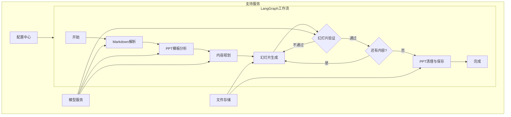
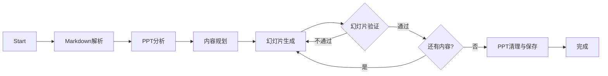
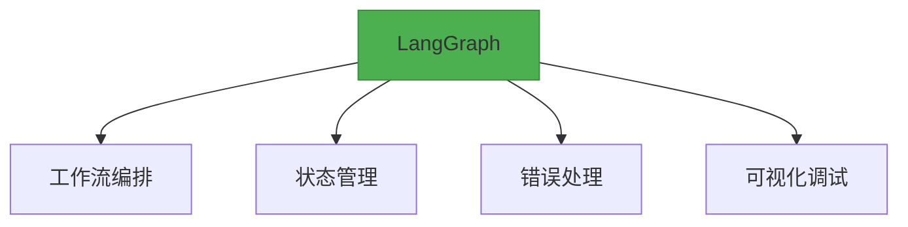

# PPT自动生成系统技术架构

## 1. 系统架构图（LangGraph版本）


## 2. 核心模块设计

### 2.1 LangGraph工作流配置
```yaml
# workflow_config.yaml
workflow:
  name: ppt_generation
  description: "PPT自动生成工作流"
  
  # 节点配置 - 只引用模型类型，具体模型名称从环境变量获取
  nodes:
    - name: markdown_parser
      agent: MarkdownAgent
      config:
        model_type: text  # 对应环境变量LLM_MODEL
        max_retries: 3
        
    - name: ppt_analyzer
      agent: PPTAnalysisAgent  
      config:
        model_type: vision  # 对应环境变量VISION_MODEL
        
    - name: content_planner
      agent: ContentPlanningAgent
      config:
        model_type: text  # 对应环境变量LLM_MODEL
        
    - name: slide_generator
      agent: SlideGeneratorAgent
      config:
        model_type: vision  # 对应环境变量VISION_MODEL
        
    - name: slide_validator
      agent: SlideValidatorAgent
      config:
        model_type: vision  # 对应环境变量VISION_MODEL
        
    - name: ppt_finalizer
      agent: PPTFinalizerAgent
  
  edges:
    - from: start
      to: markdown_parser
    - from: markdown_parser
      to: ppt_analyzer
    - from: ppt_analyzer
      to: content_planner
    - from: content_planner
      to: slide_generator
    - from: slide_generator
      to: slide_validator
      condition:
        pass: next_slide_or_end
        retry: slide_generator
    - from: next_slide_or_end
      to: slide_generator
      condition:
        has_more_content: slide_generator
        completed: ppt_finalizer
    - from: ppt_finalizer
      to: end
```

### 2.2 Agent实现规范
```python
from langgraph.graph import State

class MarkdownAgent:
    def __init__(self, config):
        self.llm = load_llm(config['llm_model'])
        
    async def run(self, state: State) -> State:
        """LangGraph节点执行规范"""
        try:
            state.content_structure = self.parse_markdown(state.raw_md)
            state.add_checkpoint("md_parsed")
            return state
        except Exception as e:
            state.failures.append(str(e))
            raise

class PPTAnalysisAgent:
    def __init__(self, config):
        self.vision_model = load_vision_model(config['vision_model'])
        self.ppt_manager = PPTManager()
        
    async def run(self, state: State) -> State:
        """使用多模态模型分析PPT模板"""
        state.slide_templates = {}
        
        # 为每页幻灯片生成截图
        for slide_id in self.ppt_manager.get_slides():
            image_path = self.ppt_manager.render_slide_as_image(slide_id)
            
            # 多模态分析幻灯片布局和特点
            analysis = self.vision_model.analyze_image(image_path)
            state.slide_templates[slide_id] = {
                'image_path': image_path,
                'analysis': analysis,
                'layout_type': analysis['layout_type'],
                'content_features': analysis['content_features']
            }
            
        return state

class ContentPlanningAgent:
    def __init__(self, config):
        self.llm = load_llm(config['llm_model'])
        
    async def run(self, state: State) -> State:
        # 根据markdown解析结果和PPT分析结果，规划内容与幻灯片匹配策略
        state.content_plan = self._plan_content_distribution(
            state.content_structure,
            state.slide_templates
        )
        state.current_section_index = 0
        return state
        
    def _plan_content_distribution(self, content, templates):
        # 利用LLM为每个内容章节选择最合适的模板
        return self.llm.generate_plan(content, templates)

class SlideGeneratorAgent:
    def __init__(self, config):
        self.ppt_manager = PPTManager()
        
    async def run(self, state: State) -> State:
        if state.current_section_index >= len(state.content_plan):
            # 所有内容都已处理完毕
            return state
            
        current_section = state.content_plan[state.current_section_index]
        template_slide = current_section['template_slide']
        content = current_section['content']
        
        # 1. 复制模板幻灯片
        new_slide_id = self.ppt_manager.duplicate_slide(template_slide)
        
        # 2. 替换内容
        self.ppt_manager.replace_text(new_slide_id, content)
        
        # 3. 渲染为图片用于验证
        image_path = self.ppt_manager.render_slide_as_image(new_slide_id)
        
        # 更新状态
        state.current_slide = {
            'slide_id': new_slide_id,
            'image_path': image_path,
            'section_index': state.current_section_index
        }
        
        return state

class SlideValidatorAgent:
    def __init__(self, config):
        self.vision_model = load_vision_model(config['vision_model'])
        self.ppt_manager = PPTManager()
        
    async def run(self, state: State) -> State:
        # 使用多模态模型分析当前幻灯片图片
        slide_image = state.current_slide['image_path']
        analysis = self.vision_model.analyze_image(slide_image)
        
        if analysis['has_issues']:
            # 需要调整
            state.slide_adjustments = analysis['suggested_adjustments']
            state.validation_result = False
            return state
        
        # 验证通过，准备处理下一章节
        state.generated_slides.append(state.current_slide)
        state.current_section_index += 1
        state.validation_result = True
        
        # 判断是否还有更多内容需要处理
        state.has_more_content = (state.current_section_index < len(state.content_plan))
        
        return state

class PPTFinalizerAgent:
    def __init__(self, config):
        self.ppt_manager = PPTManager()
        
    async def run(self, state: State) -> State:
        # 1. 删除原始模板幻灯片
        original_slides = state.slide_templates.keys()
        for slide_id in original_slides:
            self.ppt_manager.delete_slide(slide_id)
            
        # 2. 保存最终PPT文件
        output_path = f"workspace/sessions/{state.session_id}/output.pptx"
        self.ppt_manager.save(output_path)
        
        state.output_file = output_path
        state.status = "completed"
        
        return state
```

## 3. 工作流执行引擎

### 3.1 状态机设计


### 3.2 执行控制器
```python
from langgraph import StateGraph

class WorkflowEngine:
    def __init__(self):
        self.workflow = StateGraph(AgentState)
        
        # 注册节点
        self.workflow.add_node("markdown_parser", MarkdownAgent().run)
        self.workflow.add_node("ppt_analyzer", PPTAnalysisAgent().run)
        self.workflow.add_node("content_planner", ContentPlanningAgent().run)
        self.workflow.add_node("slide_generator", SlideGeneratorAgent().run)
        self.workflow.add_node("slide_validator", SlideValidatorAgent().run)
        self.workflow.add_node("ppt_finalizer", PPTFinalizerAgent().run)
        
        # 定义流程
        self.workflow.set_entry_point("markdown_parser")
        self.workflow.add_edge("markdown_parser", "ppt_analyzer")
        self.workflow.add_edge("ppt_analyzer", "content_planner")
        self.workflow.add_edge("content_planner", "slide_generator")
        
        # 条件分支：幻灯片验证
        self.workflow.add_conditional_edges(
            "slide_validator",
            self._check_validation,
            {"pass": "next_slide_or_end", "retry": "slide_generator"}
        )
        
        # 条件分支：检查是否还有内容需要处理
        self.workflow.add_conditional_edges(
            "next_slide_or_end",
            self._check_more_content,
            {"has_more_content": "slide_generator", "completed": "ppt_finalizer"}
        )
        
        self.workflow.add_edge("ppt_finalizer", END)
        
    def _check_validation(self, state: AgentState) -> str:
        return "pass" if state.validation_result else "retry"
        
    def _check_more_content(self, state: AgentState) -> str:
        return "has_more_content" if state.has_more_content else "completed"
```

## 4. 关键技术选型更新

### 4.1 统一Agent框架


### 4.2 增强模型配置
```yaml
# 模型配置中心 - 所有模型配置的唯一数据源
providers:
  openai:
    # 默认设置(当未指定时使用)
    default:
      api_base: ${OPENAI_API_BASE:https://api.openai.com/v1}
      api_key: ${OPENAI_API_KEY:}
      organization: ${OPENAI_ORGANIZATION:}
    
    # 按类型定义不同模型组
    model_groups:
      text:
        api_base: ${LLM_API_BASE:${OPENAI_API_BASE:}}  # 级联回退机制
        api_key: ${LLM_API_KEY:${OPENAI_API_KEY:}}
        default_model: gpt-4
        models:
          gpt-4:
            max_tokens: 8192
            temperature: 0.7
          gpt-3.5-turbo:
            max_tokens: 4096
            temperature: 0.7
      
      vision:
        api_base: ${VISION_API_BASE:${OPENAI_API_BASE:}}
        api_key: ${VISION_API_KEY:${OPENAI_API_KEY:}}
        default_model: gpt-4-vision
        models:
          gpt-4-vision:
            max_tokens: 4096
            temperature: 0.7
      
      embedding:
        api_base: ${EMBEDDING_API_BASE:${OPENAI_API_BASE:}}
        api_key: ${EMBEDDING_API_KEY:${OPENAI_API_KEY:}}
        default_model: text-embedding-3-large
        models:
          text-embedding-3-large:
            dimensions: 3072
          text-embedding-3-small:
            dimensions: 1536
```

## 5. 监控与调试

### 5.1 工作流监控与可视化

我们使用MLflow作为LangGraph工作流的监控和可视化工具，通过它可以跟踪工作流每个节点的执行情况、性能数据和生成结果。

```python
from core.monitoring.mlflow_tracker import MLflowTracker, register_with_langgraph

# 创建MLflow跟踪器
tracker = MLflowTracker(
    tracking_uri="http://127.0.0.1:5000",
    experiment_name="workflow_executions"
)

# 注册到工作流
workflow = StateGraph(AgentState)
register_with_langgraph(tracker, workflow)

# 开始运行并记录
with tracker.start_workflow_run(session_id="user_123", workflow_name="ppt_generation"):
    # 工作流执行...
    result = workflow.invoke({"raw_md": markdown_text, "ppt_template": template_path})
```

更多关于MLflow的使用方法，请参考[MLflow使用说明文档](../mlflow使用说明.md)。

### 5.2 调试日志示例
```json
{
  "session_id": "abc123",
  "current_node": "slide_generator",
  "state": {
    "content_structure": {...},
    "current_section_index": 2,
    "has_more_content": true,
    "validation_attempts": 1
  },
  "timeline": [
    {"node": "markdown_parser", "status": "success", "duration": 1.2},
    {"node": "ppt_analyzer", "status": "success", "duration": 3.8},
    {"node": "content_planner", "status": "success", "duration": 2.1},
    {"node": "slide_generator", "status": "success", "duration": 0.9},
    {"node": "slide_validator", "status": "success", "duration": 2.5}
  ]
}
```

## 6. 工程目录规划

```bash
ppt-assisstant/
├── apps/                  # 应用层
│   ├── api/               # FastAPI接口服务
│   │   ├── routers/       # 接口路由
│   │   │   ├── agent.py   # Agent能力接口
│   │   │   └── file.py    # 文件处理接口
│   │   ├── models/        # 接口数据模型
│   │   ├── dependencies/  # 接口依赖项
│   │   └── main.py        # FastAPI入口
│   │
│   └── web/               # 前端工程
│       ├── public/        # 静态资源
│       ├── src/           # 前端源码
│       └── package.json   # 前端依赖
│
├── core/                  # 核心业务
│   ├── agents/            # LangGraph Agent实现
│   │   ├── markdown_agent.py           # Markdown解析
│   │   ├── ppt_analysis_agent.py       # PPT分析
│   │   ├── content_planning_agent.py   # 内容规划
│   │   ├── slide_generator_agent.py    # 幻灯片生成
│   │   ├── slide_validator_agent.py    # 幻灯片验证
│   │   ├── ppt_finalizer_agent.py      # PPT清理与保存
│   │   └── base_agent.py               # 基础Agent
│   │
│   ├── workflows/         # 工作流配置
│   │   ├── ppt_gen.yaml   # 主工作流配置
│   │   └── utils.py       # 工作流工具
│   │
│   └── engine/            # 执行引擎
│       ├── state.py       # 状态管理
│       └── workflow.py    # 工作流引擎
│
├── libs/                  # 第三方库
│   ├── ppt_manager/       # PPT操作库（git子模块）
│   └── ...                # 其他子模块
│
├── workspace/             # 运行时文件
│   ├── sessions/          # 会话数据
│   │   └── {session_id}/  # 按会话隔离
│   ├── logs/              # 系统日志
│   │   └── %Y-%m/         # 按日期分片
│   └── temp/              # 临时文件
│
├── config/                # 配置中心
│   ├── settings.py        # 应用配置
│   ├── model_config.yaml  # 模型配置
│   └── workflow/          # 工作流配置
│
├── docs/                  # 文档中心
│   ├── arch/              # 架构设计
│   └── api/               # API文档
│
├── tests/                 # 测试体系
│   ├── unit/              # 单元测试
│   └── integration/       # 集成测试
│
├── Dockerfile             # 容器化构建
├── docker-compose.yml     # 服务编排
└── requirements.txt       # Python依赖
```

## 7. 相关文档

- [开发计划](./开发计划.md) - 详细的开发迭代计划和里程碑