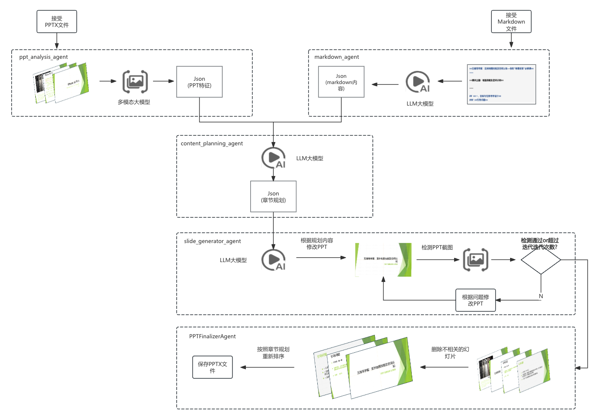
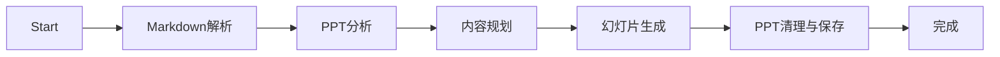
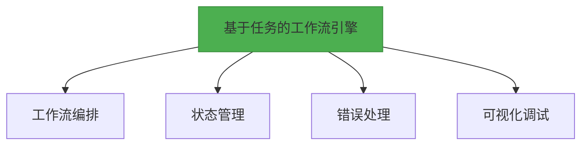

# PPT自动生成系统技术架构

## 1. 系统架构图（最新实现版本）


## 2. 核心模块设计

### 2.1 工作流配置
```yaml
# workflow_config.yaml
workflow:
  name: ppt_generation
  description: "PPT自动生成工作流"
  
  # 节点配置 - 只引用模型类型，具体模型名称从环境变量获取
  nodes:
    - name: markdown_parser
      agent: MarkdownAgent
      config:
        model_type: text  # 对应环境变量LLM_MODEL
        max_retries: 3
        
    - name: ppt_analyzer
      agent: PPTAnalysisAgent  
      config:
        model_type: vision  # 对应环境变量VISION_MODEL
        
    - name: content_planner
      agent: ContentPlanningAgent
      config:
        model_type: text  # 对应环境变量LLM_MODEL
        
    - name: slide_generator
      agent: SlideGeneratorAgent
      config:
        model_type: vision  # 对应环境变量VISION_MODEL
        use_parallel_generation: true  # 启用并行生成
        generation_max_workers: 4  # 最大并行工作数
        
    - name: ppt_finalizer
      agent: PPTFinalizerAgent
      config:
        model_type: vision  # 对应环境变量VISION_MODEL
        use_parallel_validation: true  # 启用并行验证
        validation_max_workers: 2  # 最大并行验证工作数
  
  sequence:
    - markdown_parser
    - ppt_analyzer
    - content_planner
    - slide_generator
    - ppt_finalizer
```

### 2.2 Agent实现规范
```python
class BaseAgent:
    """Agent基类，定义了所有Agent的通用接口和功能"""
    
    def __init__(self, config: Dict[str, Any]):
        """
        初始化Agent
        
        Args:
            config: Agent配置
        """
        self.config = config
        self.name = self.__class__.__name__
        
    async def run(self, state: AgentState) -> AgentState:
        """
        执行Agent的主要逻辑
        
        Args:
            state: 当前工作流状态
            
        Returns:
            更新后的工作流状态
        """
        raise NotImplementedError("Agent必须实现run方法")
    
    def add_checkpoint(self, state: AgentState) -> None:
        """
        添加工作流检查点
        
        Args:
            state: 工作流状态
        """
        pass
    
    def record_failure(self, state: AgentState, error: str) -> None:
        """
        记录失败信息
        
        Args:
            state: 工作流状态
            error: 错误信息
        """
        state.record_failure(error)
```

## 3. 工作流执行引擎

### 3.1 状态机设计


### 3.2 执行控制器
```python
class WorkflowEngine:
    """工作流引擎，负责驱动整个工作流的执行"""
    
    def __init__(self, workflow_name: str = "ppt_assisstant", enable_tracking: bool = False):
        """
        初始化工作流引擎
        
        Args:
            workflow_name: 工作流配置名称
            enable_tracking: 是否启用MLflow跟踪
        """
        # 工作流基本配置
        self.workflow_name = workflow_name
        self.config = ConfigLoader.load_workflow_config(workflow_name)
        
        # 跟踪相关
        self.enable_tracking = enable_tracking and HAS_MLFLOW

        # 初始化工作流构建器和节点执行器
        self.workflow_builder = WorkflowBuilder(
            config=self.config,
            tracker=self.tracker,
            enable_tracking=self.enable_tracking
        )
        self.node_executor = NodeExecutor(
            config=self.config,
            tracker=self.tracker,
            enable_tracking=self.enable_tracking
        )
        
        # 构建工作流图
        self.graph = self.workflow_builder.build_workflow()
    
    async def run_async(self, session_id:Optional[str]=None, raw_md:Optional[str]=None, 
                     ppt_template_path:Optional[str]=None, output_dir:Optional[str]=None, 
                     **kwargs) -> AgentState:
        """
        异步执行工作流
        
        Args:
            session_id: 会话ID，如果不提供则自动生成
            raw_md: 原始Markdown文本
            ppt_template_path: PPT模板路径
            output_dir: 输出目录
            kwargs: 允许传递额外的参数到AgentState
            
        Returns:
            执行结果 (AgentState object)
        """
        state = None
        try:
            # 按顺序执行主要节点
            error_response = await self.node_executor._execute_and_validate_node(
                "markdown_parser", state, 
                "content_structure", "Markdown解析失败，无法获取内容结构"
            )
            # ......省略细节部分

            error_response = await self.node_executor._execute_and_validate_node(
                "ppt_analyzer", state,
                "layout_features", "PPT模板分析失败，无法获取布局特征"
            )
            # ......省略细节部分
            
            error_response = await self.node_executor._execute_and_validate_node(
                "content_planner", state,
                "content_plan", "内容规划失败，无法获取内容规划结果"
            )
            # ......省略细节部分

            # 初始化生成的幻灯片列表
            state.generated_slides = []
            
            # 执行幻灯片生成和PPT完善
            await self.node_executor._execute_and_validate_node("slide_generator", state)
            await self.node_executor._execute_and_validate_node("ppt_finalizer", state)
            
            # 保存最终状态
            state.save()
            logger.info(f"工作流执行完成，会话ID: {state.session_id}")
            
            # 结束跟踪（如果启用）
            if self.enable_tracking and self.tracker:
                self.tracker.end_workflow_run("FINISHED")
                
            # 返回完整的 AgentState 对象
            return state
        # ......省略细节部分
```

## 4. 关键技术选型更新

### 4.1 统一Agent框架


### 4.2 增强模型配置
配置文件：`.env`
```yaml
# 应用环境
DEV_ENV=true  # 开发环境标志，用于启用调试功能

# OpenAI API配置（默认配置）
OPENAI_API_KEY=your_default_openai_api_key_here  # OpenAI API密钥
OPENAI_API_BASE=https://api.openai.com/v1  # API基础URL
OPENAI_ORGANIZATION=your_organization_id  # 组织ID（如有）

# LLM模型配置
LLM_API_KEY=your_llm_specific_api_key  # 文本生成模型API密钥
LLM_API_BASE=https://api.openai.com/v1  # 文本生成模型API基础URL
LLM_MODEL=gpt-4  # 文本生成模型名称
LLM_TEMPERATURE=0.2  # 生成文本的创造性程度，值越低越确定性
LLM_MAX_TOKENS=32768  # 单次请求最大标记数

# 嵌入模型配置
EMBEDDING_API_KEY=your_embedding_specific_api_key  # 嵌入模型API密钥
EMBEDDING_API_BASE=https://api.openai.com/v1  # 嵌入模型API基础URL
EMBEDDING_MODEL=text-embedding-3-large  # 嵌入模型名称

# 视觉模型配置
VISION_API_KEY=your_vision_specific_api_key  # 视觉模型API密钥
VISION_API_BASE=https://api.openai.com/v1  # 视觉模型API基础URL
VISION_MODEL=gpt-4-vision  # 视觉模型名称

# 工作目录配置
WORKSPACE_ROOT=./workspace  # 工作目录根路径

# MLFlow配置
MLFLOW_TRACKING_URI=http://127.0.0.1:5000  # MLflow跟踪服务器URI

# 最大幻灯片迭代修改次数
MAX_SLIDE_ITERATIONS=1  # 幻灯片优化的最大迭代次数

# 幻灯片生成并行处理配置
USE_PARALLEL_GENERATION=true  # 是否启用并行生成幻灯片
GENERATION_MAX_WORKERS=0  # 最大协程数，0表示自动设置为幻灯片数量

# 幻灯片验证并行处理配置
USE_PARALLEL_VALIDATION=true  # 是否启用并行验证幻灯片
VALIDATION_MAX_WORKERS=0  # 最大协程数，0表示自动设置为幻灯片数量

# 幻灯片布局分析并行处理配置
USE_PARALLEL_ANALYSIS=false  # 是否启用并行分析布局
ANALYSIS_MAX_WORKERS=0  # 最大协程数，0表示自动设置为幻灯片数量
```

## 5. 核心数据结构

### 5.1 Markdown解析输出JSON
MarkdownAgent处理原始Markdown文档后输出结构化内容，包含文档标题、副标题及章节结构：

```json
{
  "title": "五维导学案：亚洲地图技能",
  "subtitle": "地图技能及空间认知",
  "sections": [
    {
      "title": "目标与任务导学设计",
      "content": [
        "本节我们将学习亚洲地图的主要特征",
        "掌握亚洲主要地理区域的分布"
      ],
      "semantic_type": "learning_objective",
      "relation_type": "hierarchical",
      "subsections": [
        {
          "title": "学习目标",
          "content": [
            { "type": "bullet_list", "items": ["识别亚洲主要国家", "理解地理位置关系"] }
          ],
          "semantic_type": "task",
          "relation_type": "none"
        }
      ]
    }
  ]
}
```
说明：
- title: 文档标题
- subtitle: 文档副标题
- sections: 文档章节列表
- title: 章节标题
- content: 章节内容
- semantic_type: 章节语义类型
- relation_type: 章节关系类型


### 5.2 PPT布局分析输出JSON
PPTAnalysisAgent分析PPT模板后输出布局特征信息，包含幻灯片布局类型、可编辑区域和内容结构：

```json
{
  "templateName": "简约商务模板",
  "slideCount": 10,
  "slideLayouts": [
    {
      "slide_index": 0,
      "type": "封面页",
      "semantic_type": "introduction",
      "relation_type": "none",
      "layout_description": "页面包含大标题区域和副标题区域，底部有日期和作者信息",
      "content_structure": { "type": "title_content" },
      "editable_areas": {
        "title_elements": 2,
        "shape_label": 2,
        "total_editable_text_areas": 4
      },
      "content_elements": [
        {
          "element_type": "title",
          "position": "页面上部居中",
          "current_text": "演示文稿标题",
          "word_count": 5,
          "purpose": "主标题"
        }
      ]
    }
  ]
}
```
说明：
- templateName: PPT模板名称
- slideCount: 幻灯片数量
- slideLayouts: 幻灯片布局列表
- slide_index: 幻灯片索引
- type: 幻灯片类型
- semantic_type: 幻灯片语义类型
- relation_type: 幻灯片关系类型
- content_structure: 幻灯片内容结构
- editable_areas: 可编辑区域
- content_elements: 幻灯片内容元素
- element_type: 元素类型
- position: 元素位置
- current_text: 当前文本

### 5.3 内容规划输出JSON
ContentPlanningAgent将内容与模板布局相匹配，生成详细的幻灯片内容规划：

```json
{
  "slides": [
    {
      "page_number": 0,
      "slide_id": "slide_000000",
      "slide_type": "opening",
      "section": {
        "title": "五维导学案：亚洲地图技能",
        "subtitle": "地图技能及空间认知",
        "type": "title"
      },
      "template": {
        "slide_index": 0,
        "layout": "封面页"
      },
      "reasoning": "封面页布局完美匹配文档标题和副标题的需求",
      "content_match_details": {
        "editable_areas_match": "布局有title_elements=2, 内容需要1个主标题和1个副标题",
        "element_mapping": [
          {
            "section_element": "五维导学案：亚洲地图技能",
            "layout_element": {
              "position": "页面中部",
              "current_text": "演示文稿标题"
            }
          }
        ]
      }
    }
  ]
}
```
说明：
- slides: 幻灯片列表
- page_number: 幻灯片页码
- slide_id: 幻灯片ID
- slide_type: 幻灯片类型
- section: 幻灯片章节
- template: 幻灯片模板
- reasoning: 规划理由
- content_match_details: 内容匹配详情
- editable_areas_match: 可编辑区域匹配
- element_mapping: 元素映射
- section_element: 章节元素
- layout_element: 布局元素
- position: 元素位置
- current_text: 当前文本

### 5.4 LLM返回的操作指令
SlideGeneratorAgent中，LLM根据内容与布局元素的匹配关系，生成具体的操作指令：

```json
{
  "operations": [
    {
      "element_id": "0e80fd5d-d56c-4509-9403-14226b2fe892",
      "operation": "update_element_content", 
      "content": "五维导学案：亚洲地图技能"
    },
    {
      "element_id": "99a4f936-7e4a-4c22-90ee-9eb81227c2ee",
      "operation": "update_element_content",
      "content": "地图技能及空间认知"
    },
    {
      "element_id": "a5c7f126-8e4a-4c22-90ee-9eb81227c2ee",
      "operation": "adjust_text_font_size",
      "content": 24
    }
  ]
}
```
说明：
- operations: 操作列表
- element_id: 元素ID
- operation: 操作类型
- content: 操作内容

这些操作指令会被SlideGeneratorAgent执行，完成内容填充和格式调整，最终生成完整幻灯片。
具体操作PPTX是通过libs/ppt_manager/ppt_manager.py实现的，具体使用方法请参考[PPT管理器使用说明](../howto/ppt_manager使用说明.md)。

## 6. 监控与调试

### 6.1 工作流监控与可视化

我们使用MLflow作为LangGraph工作流的监控和可视化工具，通过它可以跟踪工作流每个节点的执行情况、性能数据和生成结果。

```python
from core.monitoring.mlflow_tracker import MLflowTracker, register_with_langgraph

# 创建MLflow跟踪器
tracker = MLflowTracker(
    tracking_uri="http://127.0.0.1:5000",
    experiment_name="workflow_executions"
)

# 注册到工作流
workflow = StateGraph(AgentState)
register_with_langgraph(tracker, workflow)

# 开始运行并记录
with tracker.start_workflow_run(session_id="user_123", workflow_name="ppt_generation"):
    # 工作流执行...
    result = workflow.invoke({"raw_md": markdown_text, "ppt_template": template_path})
```

更多关于MLflow的使用方法，请参考[MLflow使用说明文档](../mlflow使用说明.md)。


## 7. 工程目录规划

```bash
ppt-assisstant/
├── apps/                  # 应用层
│   ├── api/               # FastAPI接口服务
│   │   ├── routers/       # 接口路由
│   │   │   ├── agent.py   # Agent能力接口
│   │   │   └── file.py    # 文件处理接口
│   │   ├── models/        # 接口数据模型
│   │   ├── dependencies/  # 接口依赖项
│   │   └── main.py        # FastAPI入口
│   │
│   └── web/               # 前端工程
│       ├── public/        # 静态资源
│       ├── src/           # 前端源码
│       └── package.json   # 前端依赖
│
├── core/                  # 核心业务
│   ├── agents/            # LangGraph Agent实现
│   │   ├── markdown_agent.py           # Markdown解析
│   │   ├── ppt_analysis_agent.py       # PPT分析
│   │   ├── content_planning_agent.py   # 内容规划
│   │   ├── slide_generator_agent.py    # 幻灯片生成
│   │   ├── ppt_finalizer_agent.py      # PPT清理与保存
│   │   └── base_agent.py               # 基础Agent
│   │
│   ├── workflows/         # 工作流配置
│   │   ├── ppt_gen.yaml   # 主工作流配置
│   │   └── utils.py       # 工作流工具
│   │
│   └── engine/            # 执行引擎
│       ├── state.py       # 状态管理
│       └── workflow.py    # 工作流引擎
│
├── libs/                  # 第三方库
│   ├── ppt_manager/       # PPT操作库（git子模块）
│   └── ...                # 其他子模块
│
├── workspace/             # 运行时文件
│   ├── sessions/          # 会话数据
│   │   └── {session_id}/  # 按会话隔离
│   ├── logs/              # 系统日志
│   │   └── %Y-%m/         # 按日期分片
│   └── temp/              # 临时文件
│
├── config/                # 配置中心
│   ├── settings.py        # 应用配置
│   ├── model_config.yaml  # 模型配置
│   └── workflow/          # 工作流配置
│
├── docs/                  # 文档中心
│   ├── arch/              # 架构设计
│   └── api/               # API文档
│
├── tests/                 # 测试体系
│   ├── unit/              # 单元测试
│   └── integration/       # 集成测试
│
├── Dockerfile             # 容器化构建
├── docker-compose.yml     # 服务编排
└── requirements.txt       # Python依赖
```

## 8. 相关文档

- [开发计划](./开发计划.md) - 详细的开发迭代计划和里程碑