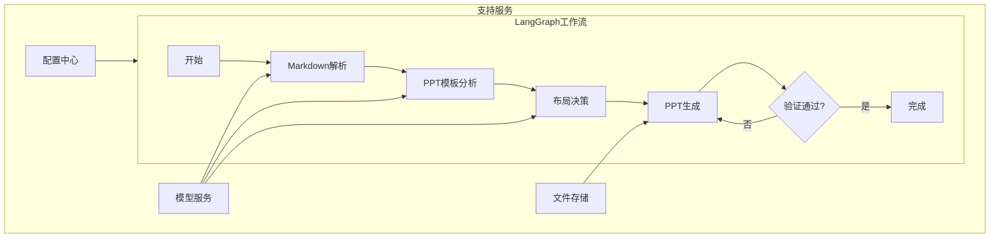
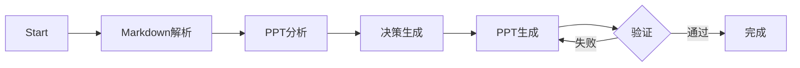
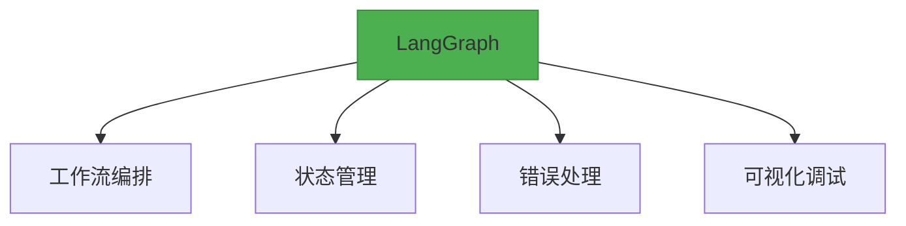
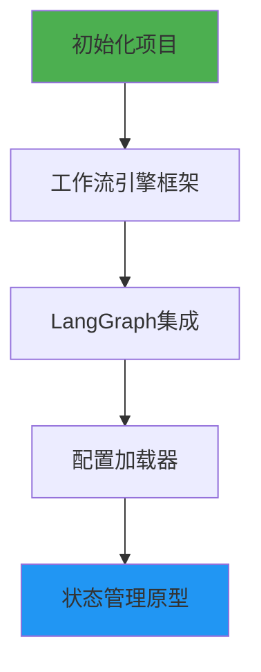
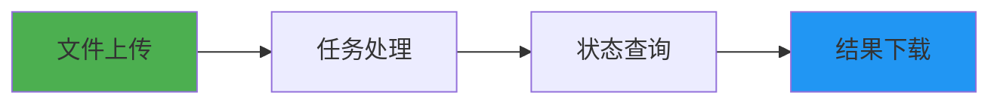

# PPT自动生成系统技术架构

## 1. 系统架构图（LangGraph版本）


## 2. 核心模块设计

### 2.1 LangGraph工作流配置
```yaml
# workflow_config.yaml
workflow:
  name: ppt_generation
  nodes:
    - name: markdown_parser
      agent: MarkdownAgent
      config:
        llm_model: gpt-4
        max_retries: 3
        
    - name: ppt_analyzer
      agent: PPTAnalysisAgent  
      config:
        vision_model: gpt-4-vision
        
    - name: layout_decider
      agent: LayoutDecisionAgent
      config:
        embedding_model: text-embedding-3-large
        
  edges:
    - from: start
      to: markdown_parser
    - from: markdown_parser
      to: ppt_analyzer
    - from: ppt_analyzer
      to: layout_decider
    - from: layout_decider
      to: ppt_generator
    - from: ppt_generator
      to: validator
      condition: 
        pass: end
        retry: ppt_generator
```

### 2.2 Agent实现规范
```python
from langgraph.graph import State

class MarkdownAgent:
    def __init__(self, config):
        self.llm = load_llm(config['llm_model'])
        
    async def run(self, state: State) -> State:
        """LangGraph节点执行规范"""
        try:
            state.content_structure = self.parse_markdown(state.raw_md)
            state.add_checkpoint("md_parsed")
            return state
        except Exception as e:
            state.failures.append(str(e))
            raise

class PPTGeneratorAgent:
    def __init__(self, config):
        self.template_path = config['template']
        
    async def run(self, state: State) -> State:
        state.ppt_file = self.generate_ppt(state.decision_result)
        return state
```

## 3. 工作流执行引擎

### 3.1 状态机设计


### 3.2 执行控制器
```python
from langgraph import StateGraph

class WorkflowEngine:
    def __init__(self):
        self.workflow = StateGraph(AgentState)
        
        # 注册节点
        self.workflow.add_node("md_parse", MarkdownAgent().run)
        self.workflow.add_node("ppt_analyze", PPTAnalysisAgent().run)
        
        # 定义流程
        self.workflow.set_entry_point("md_parse")
        self.workflow.add_edge("md_parse", "ppt_analyze")
        
        # 条件分支
        self.workflow.add_conditional_edges(
            "validate",
            self._check_validation,
            {"pass": END, "retry": "ppt_generate"}
        )
        
    def _check_validation(self, state: AgentState) -> str:
        return "pass" if state.validation_result else "retry"
```

## 4. 关键技术选型更新

### 4.1 统一Agent框架


### 4.2 增强模型配置
```yaml
model_providers:
  langgraph:
    workflow_config: config/workflows/
    agent_config: config/agents/
    
  llm:
    - type: openai
      models:
        - name: gpt-4
          api_key_env: OPENAI_KEY
          
  vision:
    - type: openai
      models:
        - name: gpt-4-vision
```

## 5. 监控与调试

### 5.1 可视化跟踪
```python
from langgraph.monitoring import LangfuseHandler

workflow = StateGraph(AgentState)
workflow.add_handler(LangfuseHandler(
    tracing_endpoint="https://cloud.langfuse.com",
    public_key="pk-lf-...",
    secret_key="sk-lf-..."
))
```

### 5.2 调试日志示例
```json
{
  "session_id": "abc123",
  "current_node": "ppt_generate",
  "state": {
    "content_structure": {...},
    "layout_features": [...],
    "validation_attempts": 2
  },
  "timeline": [
    {"node": "md_parse", "status": "success", "duration": 1.2},
    {"node": "ppt_analyze", "status": "success", "duration": 3.8}
  ]
}
```

## 6. 工程目录规划

```bash
ppt-assisstant/
├── apps/                  # 应用层
│   ├── api/               # FastAPI接口服务
│   │   ├── routers/       # 接口路由
│   │   │   ├── agent.py   # Agent能力接口
│   │   │   └── file.py    # 文件处理接口
│   │   ├── models/        # 接口数据模型
│   │   ├── dependencies/  # 接口依赖项
│   │   └── main.py        # FastAPI入口
│   │
│   └── web/               # 前端工程
│       ├── public/        # 静态资源
│       ├── src/           # 前端源码
│       └── package.json   # 前端依赖
│
├── core/                  # 核心业务
│   ├── agents/            # LangGraph Agent实现
│   │   ├── md_agent.py    # Markdown解析
│   │   ├── ppt_agent.py   # PPT分析
│   │   └── ...           
│   │
│   ├── workflows/         # 工作流配置
│   │   ├── ppt_gen.yaml   # 主工作流配置
│   │   └── utils.py       # 工作流工具
│   │
│   └── engine/            # 执行引擎
│       ├── state.py       # 状态管理
│       └── validator.py   # 验证逻辑
│
├── libs/                  # 第三方库
│   ├── ppt_manager/       # PPT操作库（git子模块）
│   └── ...                # 其他子模块
│
├── workspace/             # 运行时文件
│   ├── sessions/          # 会话数据
│   │   └── {session_id}/  # 按会话隔离
│   ├── logs/              # 系统日志
│   │   └── %Y-%m/         # 按日期分片
│   └── temp/              # 临时文件
│
├── config/                # 配置中心
│   ├── settings.py        # 应用配置
│   ├── model_config.yaml  # 模型配置
│   └── workflow/          # 工作流配置
│
├── docs/                  # 文档中心
│   ├── arch/              # 架构设计
│   └── api/               # API文档
│
├── tests/                 # 测试体系
│   ├── unit/              # 单元测试
│   └── integration/       # 集成测试
│
├── Dockerfile             # 容器化构建
├── docker-compose.yml     # 服务编排
└── requirements.txt       # Python依赖
```

## 7.第一阶段开发计划

### 7.1 迭代开发计划（双周冲刺）

#### 冲刺1：工作流引擎基础


**开发任务**：
1. 初始化Python项目结构
2. 实现基础工作流引擎类
3. 集成LangGraph核心库
4. 开发配置加载模块
5. 实现基础状态管理

**交付物**：
- 可运行的工作流引擎原型
- 基础配置管理系统

### 冲刺2：核心Agent开发


**开发任务**：
1. Markdown结构解析Agent
2. PPT模板分析Agent
3. 布局匹配决策Agent
4. 基础PPT生成Agent

**交付物**：
- 核心Agent可独立运行
- 根据提供的PPT和markdown文件，可以生成PPT

#### 冲刺3：API服务与整合


**开发任务**：
1. 文件上传接口开发
2. 异步任务处理系统
3. 任务状态查询接口
4. 结果文件下载接口

**交付物**：
- 可运行的API服务
- Postman测试集合
- Swagger接口文档