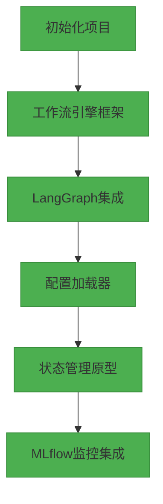
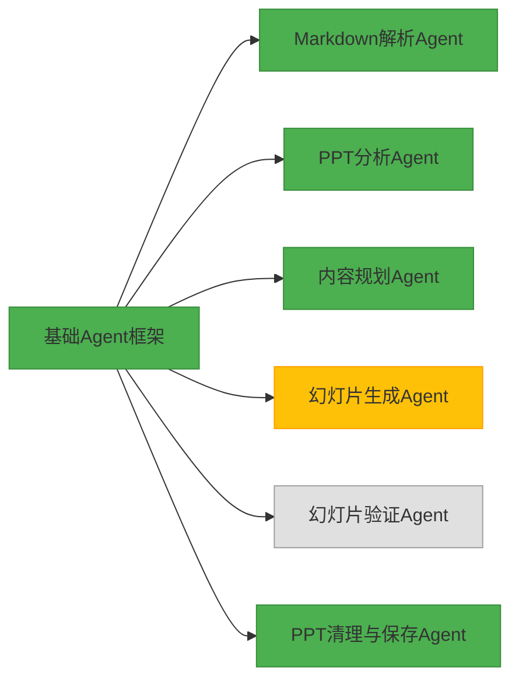
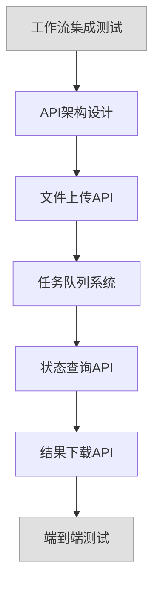

# PPT自动生成系统开发计划

## 1. 第一阶段开发计划

### 1.1 迭代开发计划（双周冲刺）

#### 冲刺1：工作流引擎基础（第1-2周）✅


**开发任务细化**：

1. **项目初始化**（1天）✅
   - 创建项目骨架和目录结构 ✅
   - 设置开发环境和依赖管理 ✅
   - 初始化Git仓库和版本控制 ✅

2. **工作流引擎框架**（3天）✅
   - 实现StateGraph基础框架 ✅
   - 开发节点注册机制 ✅
   - 实现基础事件处理系统 ✅

3. **LangGraph集成**（2天）✅
   - 集成LangGraph核心库 ✅
   - 实现节点间状态传递机制 ✅
   - 开发工作流可视化工具 ✅

4. **配置加载模块**（3天）✅
   - 构建YAML配置解析器 ✅
   - 实现环境变量与配置合并 ✅
   - 开发模型配置管理系统 ✅
   - 创建工作流配置验证器 ✅

5. **状态管理系统**（3天）✅
   - 设计AgentState数据结构 ✅
   - 实现状态持久化机制 ✅
   - 开发状态回滚和错误处理 ✅
   - 创建状态检查点系统 ✅

6. **MLflow监控集成**（3天）🔄
   - 实现MLflowTracker类 ✅
   - 开发工作流节点执行监控 ✅
   - 实现执行指标收集 ✅
   - 创建可视化跟踪界面 🔄

**交付物**：
- 可运行的工作流引擎原型 ✅
- 基础配置管理系统 ✅
- MLflow监控与可视化面板 🔄
- 状态管理与错误处理系统 ✅

#### 冲刺2：核心Agent开发（第3-4周）🔄


**开发任务细化**：

1. **基础Agent框架**（2天）✅
   - 设计BaseAgent抽象类 ✅
   - 实现通用LLM/Vision调用接口 ✅
   - 开发错误处理与重试机制 ✅
   - 建立Agent注册系统 ✅

2. **MarkdownAgent开发**（3天）✅
   - 实现Markdown解析器 ✅
   - 开发文档结构提取器 ✅
   - 创建内容分类与标签系统 ✅
   - 实现章节分割与层次检测 ✅
   - 集成LLM进行内容理解与分析 ✅
   - 单元测试与集成测试 ✅

3. **PPTAnalysisAgent开发**（4天）✅
   - 集成PPT Manager获取幻灯片 ✅
   - 实现幻灯片截图生成 ✅
   - 开发多模态模型调用接口 ✅
   - 实现幻灯片布局分析 ✅
   - 创建模板特征提取系统 ✅
   - 开发幻灯片元素分类 ✅
   - 单元测试与集成测试 ✅

4. **ContentPlanningAgent开发**（3天）✅
   - 设计内容-模板匹配算法 ✅
   - 实现章节与幻灯片布局匹配 ✅
   - 开发内容分布优化系统 ✅
   - 创建内容计划生成器 ✅
   - 实现格式转换与标准化 ✅
   - 单元测试与集成测试 ✅

5. **SlideGeneratorAgent开发**（4天）🔄
   - 实现幻灯片复制与创建 ✅
   - 开发文本内容替换系统 ✅
   - 实现图像与多媒体处理 ⏳
   - 创建格式与样式保持机制 ⏳
   - 单元测试与集成测试 ⏳

6. **SlideValidatorAgent开发**（3天）⏳
   - 集成多模态分析功能 ⏳
   - 实现文本溢出检测 ⏳
   - 开发布局错误识别 ⏳
   - 创建格式问题检测系统 ⏳
   - 实现调整建议生成 ⏳
   - 单元测试与集成测试 ⏳

7. **PPTFinalizerAgent开发**（2天）✅
   - 实现模板幻灯片清理 ✅
   - 开发幻灯片排序系统 ✅
   - 创建元数据更新机制 ✅
   - 实现文件保存与导出 ✅
   - 单元测试与集成测试 ✅

**交付物**：
- 完整的核心Agent实现 🔄
- 每个Agent的单元测试 🔄
- Agent间交互的集成测试 🔄
- 支持逐页生成、验证和调整的工作流系统 🔄

#### 冲刺3：工作流集成与API开发（第5-6周）⏳


**开发任务细化**：

1. **工作流集成测试**（3天）⏳
   - 实现端到端工作流测试 ⏳
   - 开发模拟数据生成 ⏳
   - 创建测试场景集合 ⏳
   - 性能基准测试 ⏳
   - 错误恢复测试 ⏳

2. **API架构设计**（2天）⏳
   - 设计RESTful API结构 ⏳
   - 实现OpenAPI规范文档 ⏳
   - 开发API认证系统 ⏳
   - 创建请求验证机制 ⏳

3. **文件上传API**（2天）⏳
   - 实现文件上传端点 ⏳
   - 开发文件类型验证 ⏳
   - 创建文件大小限制 ⏳
   - 实现安全存储机制 ⏳
   - 单元测试与集成测试 ⏳

4. **任务队列系统**（3天）⏳
   - 实现异步任务处理器 ⏳
   - 开发任务优先级队列 ⏳
   - 创建任务状态跟踪系统 ⏳
   - 实现错误处理与重试 ⏳
   - 单元测试与集成测试 ⏳

5. **状态查询API**（2天）⏳
   - 实现任务状态查询端点 ⏳
   - 开发进度指示器 ⏳
   - 创建实时更新机制 ⏳
   - 单元测试与集成测试 ⏳

6. **结果下载API**（2天）⏳
   - 实现文件下载端点 ⏳
   - 开发文件缓存系统 ⏳
   - 创建安全访问控制 ⏳
   - 实现文件清理策略 ⏳
   - 单元测试与集成测试 ⏳

7. **端到端测试与文档**（3天）⏳
   - 创建Postman集合 ⏳
   - 实现端到端测试脚本 ⏳
   - 开发API文档生成 ⏳
   - 创建使用示例与指南 ⏳

**交付物**：
- 完整的API服务 ⏳
- Postman测试集合 ⏳
- Swagger/OpenAPI文档 ⏳
- 端到端测试套件 ⏳
- 用户指南文档 ⏳

## 2. 第二阶段开发计划

### 2.1 核心功能增强（第7-12周）

#### 冲刺4：内容理解与生成增强（第7-8周）

**开发任务细化**：

1. **Markdown解析增强**（3天）⏳
   - 实现复杂表格支持 ⏳
   - 开发公式与数学表达式解析 ⏳
   - 创建链接与引用处理 ⏳
   - 实现自定义扩展语法 ⏳

2. **多模态内容生成**（4天）⏳
   - 集成图像生成API ⏳
   - 实现图表数据可视化 ⏳
   - 开发数据表格生成 ⏳
   - 创建配图推荐系统 ⏳

3. **高级布局算法**（5天）⏳
   - 实现智能内容分布 ⏳
   - 开发自适应布局系统 ⏳
   - 创建排版优化引擎 ⏳
   - 实现响应式布局调整 ⏳

4. **PPT样式增强**（3天）⏳
   - 实现主题样式一致性 ⏳
   - 开发颜色方案优化 ⏳
   - 创建字体体系管理 ⏳
   - 实现美学评分系统 ⏳

#### 冲刺5：用户交互与体验优化（第9-10周）

**开发任务细化**：

1. **实时预览系统**（4天）⏳
   - 实现WebSocket实时更新 ⏳
   - 开发幻灯片渲染预览 ⏳
   - 创建进度实时反馈 ⏳
   - 实现部分结果展示 ⏳

2. **编辑建议系统**（5天）⏳
   - 实现智能排版建议 ⏳
   - 开发内容优化提示 ⏳
   - 创建设计改进建议 ⏳
   - 实现交互式修改接口 ⏳

3. **风格定制系统**（4天）⏳
   - 实现PPT模板管理 ⏳
   - 开发用户喜好学习 ⏳
   - 创建风格迁移引擎 ⏳
   - 实现品牌指南集成 ⏳

4. **批处理系统**（2天）⏳
   - 实现批量任务提交 ⏳
   - 开发任务分组管理 ⏳
   - 创建进度聚合显示 ⏳
   - 实现批量下载功能 ⏳

#### 冲刺6：企业级功能（第11-12周）

**开发任务细化**：

1. **多用户协作系统**（5天）⏳
   - 实现用户角色与权限 ⏳
   - 开发实时协作编辑 ⏳
   - 创建变更通知系统 ⏳
   - 实现冲突解决机制 ⏳

2. **版本管理系统**（3天）⏳
   - 实现幻灯片版本控制 ⏳
   - 开发变更历史记录 ⏳
   - 创建回滚功能 ⏳
   - 实现差异对比工具 ⏳

3. **企业集成系统**（4天）⏳
   - 实现SSO认证集成 ⏳
   - 开发企业资产库 ⏳
   - 创建审批工作流 ⏳
   - 实现安全访问控制 ⏳

4. **高级分析仪表板**（3天）⏳
   - 实现使用情况分析 ⏳
   - 开发性能监控图表 ⏳
   - 创建用户行为分析 ⏳
   - 实现资源使用报告 ⏳

### 2.2 系统稳定性与性能优化（第13-16周）

#### 冲刺7：性能优化（第13-14周）

**开发任务细化**：

1. **分布式任务处理**（5天）⏳
   - 实现水平扩展架构 ⏳
   - 开发负载均衡策略 ⏳
   - 创建分片任务处理 ⏳
   - 实现结果聚合系统 ⏳

2. **缓存优化**（3天）⏳
   - 实现多级缓存架构 ⏳
   - 开发缓存失效策略 ⏳
   - 创建预加载机制 ⏳
   - 实现存储优化 ⏳

3. **资源使用优化**（4天）⏳
   - 实现资源限制控制 ⏳
   - 开发智能调度系统 ⏳
   - 创建资源回收机制 ⏳
   - 实现限流与降级策略 ⏳

4. **模型调用优化**（3天）⏳
   - 实现批处理请求 ⏳
   - 开发模型选择策略 ⏳
   - 创建请求合并机制 ⏳
   - 实现并行调用优化 ⏳

#### 冲刺8：监控与可靠性（第15-16周）

**开发任务细化**：

1. **全面监控系统**（4天）⏳
   - 实现详细日志记录 ⏳
   - 开发指标收集系统 ⏳
   - 创建告警机制 ⏳
   - 实现异常检测 ⏳

2. **自动恢复机制**（3天）⏳
   - 实现健康检查系统 ⏳
   - 开发自动重启策略 ⏳
   - 创建故障转移机制 ⏳
   - 实现数据备份恢复 ⏳

3. **负载测试与优化**（5天）⏳
   - 实现负载生成器 ⏳
   - 开发性能测试套件 ⏳
   - 创建压力测试场景 ⏳
   - 实现瓶颈分析工具 ⏳

4. **持续集成/部署**（3天）⏳
   - 实现自动化测试 ⏳
   - 开发CI/CD流水线 ⏳
   - 创建蓝绿部署策略 ⏳
   - 实现回滚机制 ⏳

## 3. 总体时间线

```mermaid
gantt
    title PPT自动生成系统开发计划
    dateFormat  YYYY-MM-DD
    section 第一阶段
    冲刺1: 工作流引擎基础    :done, a1, 2024-04-01, 14d
    冲刺2: 核心Agent开发     :active, a2, after a1, 14d
    冲刺3: API服务与整合     :a3, after a2, 14d
    section 第二阶段
    冲刺4: 内容理解与生成增强 :b1, after a3, 14d
    冲刺5: 用户交互优化       :b2, after b1, 14d
    冲刺6: 企业级功能         :b3, after b2, 14d
    section 第三阶段
    冲刺7: 性能优化           :c1, after b3, 14d
    冲刺8: 监控与可靠性       :c2, after c1, 14d
```

## 4. 图例说明

- ✅ 已完成
- 🔄 进行中
- ⏳ 未开始 