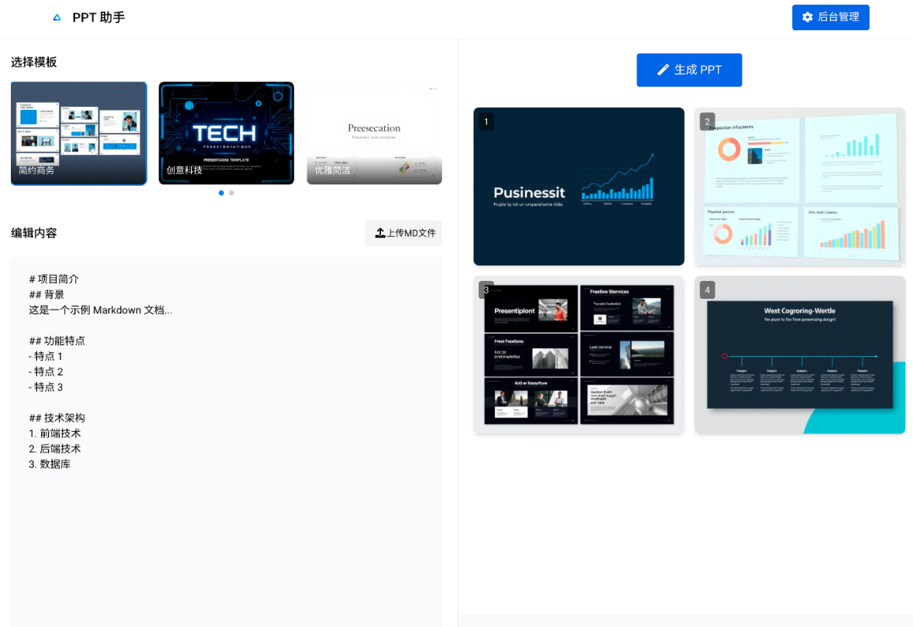

# PPT助手系统需求文档

## 1. 项目概述

PPT助手是一个基于AI的演示文稿自动生成系统，能够将Markdown文档内容自动转换为精美的PPT幻灯片。系统使用大型语言模型和计算机视觉技术，根据内容智能匹配模板布局，生成结构合理、视觉优美的演示文稿。

## 2. 功能需求

### 2.1 用户前端功能

#### 2.1.1 PPT生成演示页面

1. **模板选择功能**
   - 提供系统预置的PPT模板列表
   - 显示模板预览图
   - 允许用户选择心仪的模板进行内容生成

2. **Markdown编辑功能**
   - 提供Markdown编辑框
   - 预置示例Markdown内容
   - 支持用户修改、复制粘贴Markdown内容
   - 支持Markdown文件上传按钮，可以将Markdown文件内容直接粘贴到编辑框中

3. **PPT生成功能**
   - 提供"生成PPT"按钮
   - 生成过程中禁用其他操作控件
   - 显示生成进度和当前执行的任务
   - 生成完成后显示成功提示

4. **生成进度展示**
   - 通过进度条展示当前生成进度
   - 显示当前正在执行的任务，如：
     - Agent正在分析markdown文档内容
     - Agent正在进行内容梳理规划
     - Agent正在进行PPTX文件的编辑
     - Agent正在进行修改后PPTX文件的视觉校验
   - 生成过程中，如果出现错误，会显示错误信息，并提供重试按钮
   - 生成过程中，会将生成的PPT文件截图展示在页面中，方便用户查看
   - 生成过程中，会显示当前生成进度，并提供取消按钮，用户可以随时取消生成任务

5. **PPT下载功能**
   - 生成完成后提供下载按钮
   - 支持下载生成的PPTX文件

### 3.2 后台管理功能

1. **管理入口**
   - 在前端页面右上角提供后台管理入口
   - 点击后跳转至后台登录页面

2. **用户认证**
   - 提供登录表单
   - 验证用户身份
   - 登录成功后进入管理界面

3. **模板管理功能**
   - **模板列表查看**
     - 显示所有可用的PPT模板
     - 提供模板预览功能
     - 显示模板名称、添加时间等基本信息
   
   - **模板上传功能**
     - 提供模板上传表单
     - 支持PPTX文件上传
     - 上传后自动进行模板分析
     - 生成模板描述文件和预览图片
   
   - **模板删除功能**
     - 提供删除模板的选项
     - 确认后删除模板文件、预览图和描述文件
   
   - **模板查看功能**
     - 查看模板文件信息
     - 查看模板预览图
     - 查看模板分析后的JSON描述信息

## 4. 非功能需求

### 4.1 性能需求

- PPT生成时间应控制在可接受范围内（建议不超过3分钟）
- 系统应能并发处理多个用户的PPT生成请求
- 后台管理界面响应时间应不超过2秒

### 4.2 安全需求

- 后台管理功能必须有适当的认证和授权机制
- 用户上传的内容应进行安全检查，防止恶意代码
- 系统应具备基本的防SQL注入、XSS攻击等安全防护能力

### 4.3 可用性需求

- 界面设计应简洁直观，易于使用
- 提供明确的操作提示和错误反馈
- 支持主流浏览器（Chrome, Firefox, Safari, Edge）

### 4.4 可扩展性需求

- 系统架构应支持未来增加更多模板和功能
- 应便于集成更多的AI模型和功能
- 设计应支持未来可能的功能扩展

## 5. 交互设计

### 5.1 前端页面设计

- 简洁现代的界面风格
- 直观的模板选择区域，可显示模板缩略图
- 占据主要区域的Markdown编辑框
- 明显的"生成PPT"按钮
- 生成过程中的进度条和任务描述
- 生成完成后的下载按钮
- 右上角的后台管理入口

说明：
- 交互设计原稿地址:https://mastergo.com/prototyping/161452751686940?fileOpenFrom=home&page_id=M

### 5.2 后台管理界面设计

- 简洁的登录页面
- 清晰的模板管理主界面
- 表格形式展示的模板列表
- 模态窗口形式的模板上传表单
- 模板详情查看页面，展示模板信息和JSON数据
- 操作确认对话框（如删除确认）

## 7. 数据模型

### 7.1 模板数据

- 模板ID
- 模板名称
- 模板文件路径
- 预览图路径
- 模板描述JSON路径
- 上传时间
- 分析状态

### 7.2 用户数据

- 用户ID
- 用户名
- 密码（加密存储）
- 角色（管理员/普通用户）

### 7.3 生成任务数据

- 任务ID
- 用户ID
- 模板ID
- Markdown内容
- 生成状态
- 开始时间
- 完成时间
- 输出文件路径

## 8. 技术实现考虑

- 使用现有的Agent架构和工作流引擎实现核心功能
- 前端使用现代JavaScript框架（如React, Vue）构建用户界面
- 后端使用RESTful API提供服务
- 使用数据库存储模板和用户信息
- 文件存储系统管理模板文件和生成的PPT文件
- 使用消息队列管理长时间运行的PPT生成任务

## 9. 限制与约束

- 系统当前仅支持从Markdown生成PPT
- 模板分析过程可能需要一定时间
- PPT生成过程依赖外部AI服务的可用性
- 生成的PPT可能需要少量人工微调以达到最佳效果

## 10. 未来扩展方向

- 支持更多输入格式（如Word文档、纯文本）
- 提供更丰富的模板库
- 允许用户上传自定义模板
- 增加生成PPT的自定义选项
- 提供生成历史记录和重用功能
- 集成更多AI功能，如内容优化、图片生成等 